# Architecture — Local AI

Deep-dive into the runtime design of the chat engine and its companion
services. For setup, SSO enablement and a module map, see the
[README](README.md); the manual regression plan lives in
[TEST_STEPS.md](TEST_STEPS.md) (section numbers below are referenced there).

The engine's implementation lives in `server/` + `server/features/`;
`chat-webui.py` is the entrypoint that owns all shared state. Feature modules
never bind shared names at import — they resolve `M.<name>` at call time
through the `state.register_entrypoint(...)` proxy, which is what keeps
per-test monkeypatching of `chat-webui.<name>` working everywhere.

## System Design

### 1. Infrastructure & Network

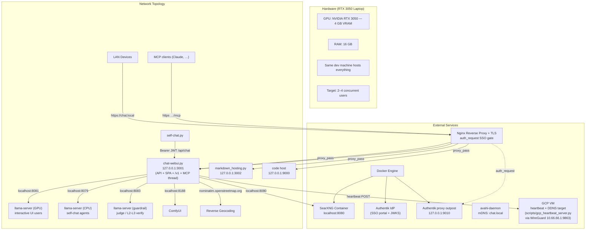

### 2. Code Layout & Build

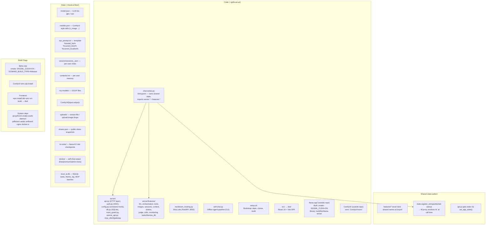

### 3. Runtime Constants & Locks

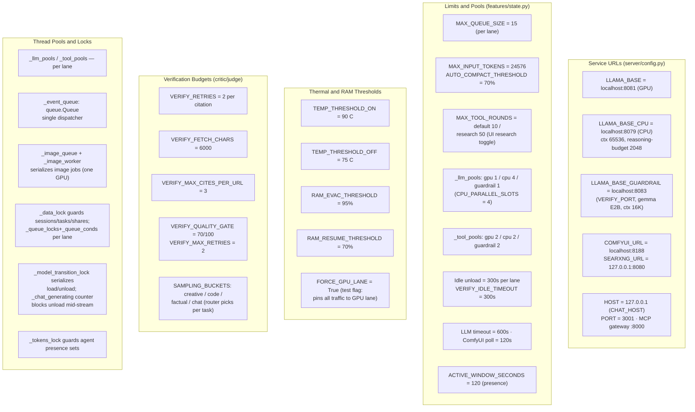

### 4. Server Startup

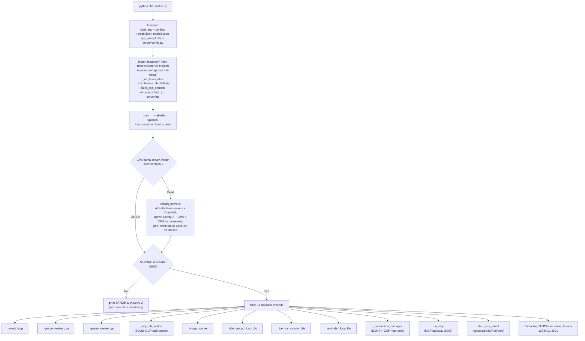

CPU (8079) and guardrail (8083) llama-servers are **lazy**: `ensure_llama_server`
/ the MCP gateway start them on first use; `_idle_unload_loop` unloads their
models after 300s idle.

### 5. Model State Machines

Three independent state machines — one per llama-server lane.

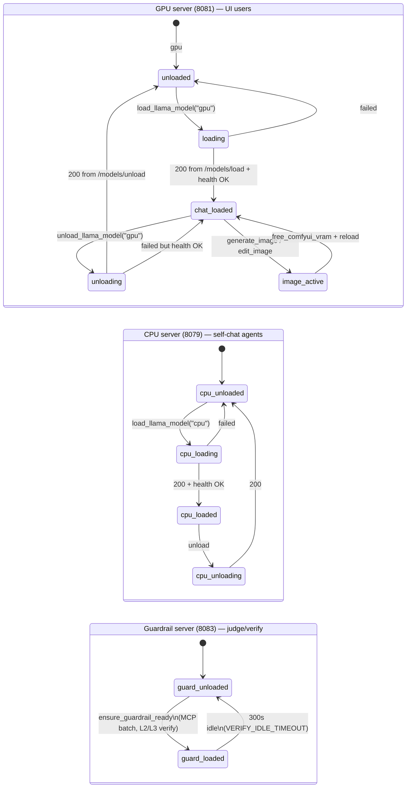

Image generation unloads **only** the GPU server; CPU agents keep serving.
Per-lane idle timestamps (`_last_llm_use`, `_cpu_last_llm_use`,
`_guardrail_last_llm_use`) drive independent unloads. Before any unload the KV
cache is checkpointed to `kv-slots/` (`--slot-save-path`, per-session `_session_kv`)
and restored after reload, so long conversations don't re-prefill.

### 6. REST API Endpoints (`chat-webui` :3001)

```mermaid
graph TD
    Client([User Client])

    subgraph AuthEndpoints ["Auth (SSO)"]
        Client -->|"Browser: nginx auth_request → SSO portal"| SSO["X-Authentik-* forwarded upstream"]
        Client -->|"GET /api/check-auth"| CheckAuth["identity_from_headers →\n{authenticated, username, role}"]
        Client -->|"Agents: Authorization: Bearer <JWT>"| Bearer["Verify vs Authentik JWKS\n(server/auth.py)"]
        Client -->|"POST /api/register-agent · POST /api/logout"| AgentTok["Agent token / session end"]
    end

    subgraph SessionEndpoints ["Sessions"]
        Client -->|"POST /api/sessions"| NewSession["Create UUID session"]
        Client -->|"GET /api/sessions"| ListSessions["List user sessions (updated desc)"]
        Client -->|"GET /api/sessions/:id/messages"| GetMessages["Messages + token_estimate"]
        Client -->|"PUT /api/sessions/:id"| RenameSession
        Client -->|"DELETE /api/sessions/:id"| DeleteSession["Delete + cleanup output/upload images"]
    end

    subgraph ChatEndpoints ["Chat & Tasks"]
        Client -->|"POST /api/chat\n{session_id, message, image?, audio?,\nresearch?, cpu?, mode?, no_tools?}"| Chat["→ {task_id}, queued per lane"]
        Client -->|"GET /api/status/:task_id"| Poll["status/message/response/tools_used/image"]
        Client -->|"GET/POST/PUT/DELETE /api/tasks"| Tasks["To-dos + reminders (SQLite)"]
        Client -->|"GET /api/themes"| Themes["Theme log + stats"]
        Client -->|"GET /api/model-status"| ModelStatus["model, tps, overheated, gpu_temp,\nram_evacuating, max_context, reminders"]
    end

    subgraph ShareEndpoints ["Shares"]
        Client -->|"POST /api/shares · GET /api/shares\nDELETE /api/shares/:token"| Shares["Snapshot a message"]
        Client -->|"GET /s/:token (SPA page)"| SharePage["Public read-only view"]
        Client -->|"GET /api/public/share/:token\n+ /image/:path"| ShareAPI["Snapshot JSON + scoped image serving"]
    end

    subgraph UtilityEndpoints ["Utility"]
        Client -->|"POST /api/extract-file · POST /api/upload-image"| Uploads["Save to uploads/ → {url,name}"]
        Client -->|"GET /api/image/:id"| ImgEdit["Serve working image"]
        Client -->|"POST /api/location"| SetLocation["Nominatim reverse geocode"]
        Client -->|"GET/POST /api/user-context"| UserCtx["read/append; overwrite = admin only"]
        Client -->|"POST /api/tts"| TTS["Piper local, edge-tts fallback"]
        Client -->|"GET /api/active-users · POST /api/leaving"| Presence["Active window tracking"]
        Client -->|"GET /output/… · GET /uploads/…"| ServeFiles["Identity-gated file serving"]
    end

    subgraph OpenAIEndpoints ["OpenAI-compatible /v1/* (Bearer OPENAI_API_KEY)"]
        Client -->|"GET /v1/models · /v1/models/:id"| V1M["Model list/retrieve"]
        Client -->|"POST /v1/chat/completions"| V1C["Non-stream + SSE streaming,\nincremental tool_calls, multimodal image_url"]
    end

    subgraph SPA ["Static / SPA Serving"]
        Client -->|"GET / · /s/:token · fallback"| SPAIndex["dist/index.html; assets from dist/"]
    end
```

### 7. Chat Ingress & Lane Routing

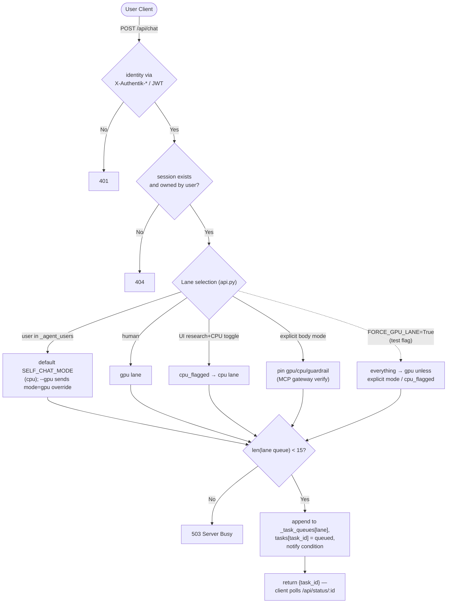

### 8. Queue Workers (one per lane)

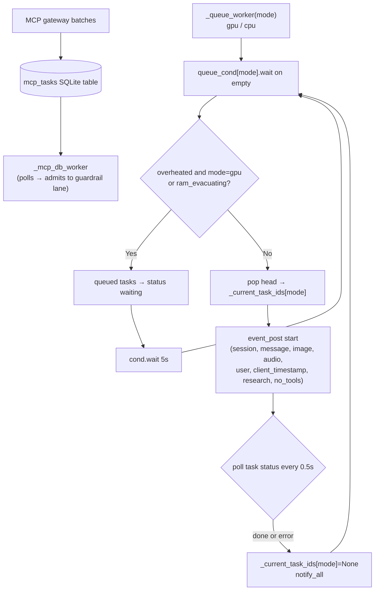

The two human/agent lanes never wait behind each other. Guardrail-lane tasks
arrive through the SQLite queue via `_mcp_db_worker`, not an in-memory list.

### 9. Event Loop Pipeline (features/orchestration.py)

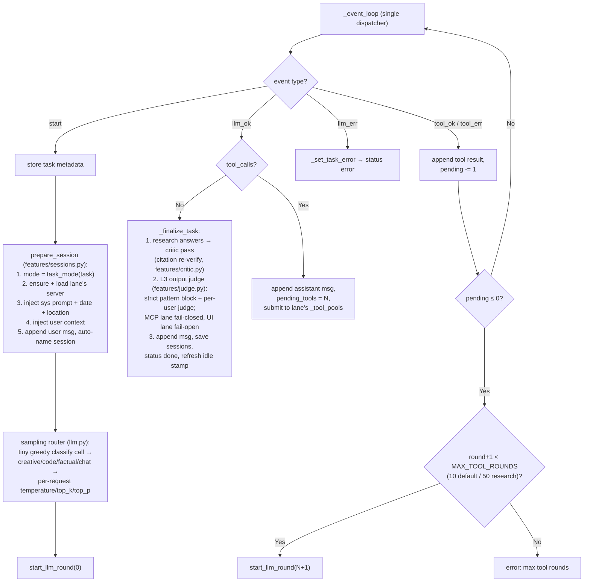

### 10. LLM Worker (features/llm.py)

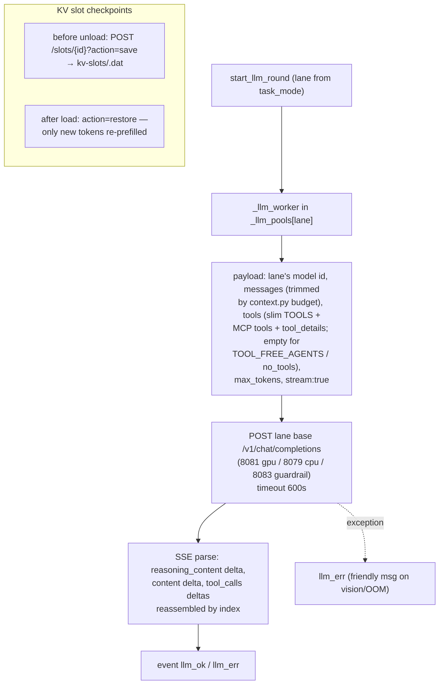

### 11. Tool Worker (features/tools.py)

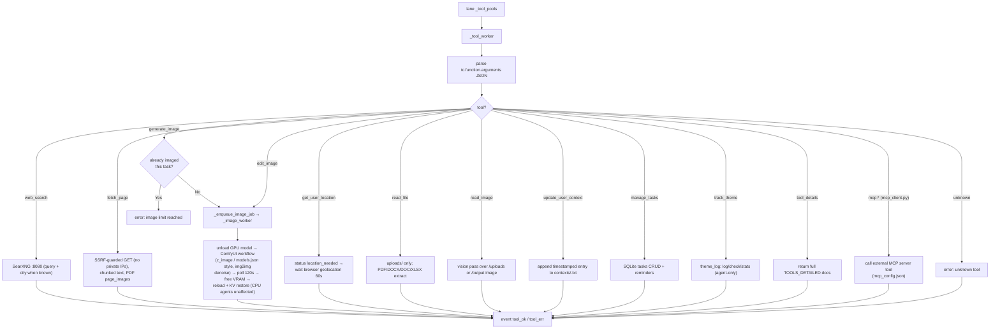

### 12. Resource Management (features/monitoring.py)

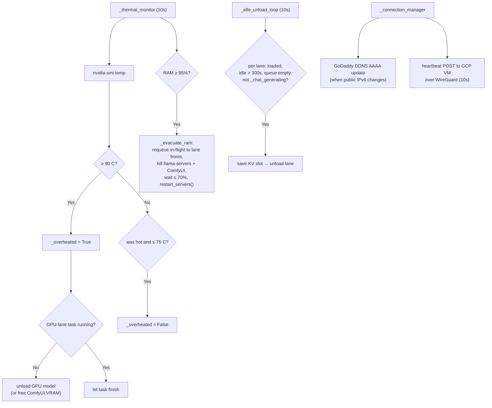

### 13. Moderation & Verification Pipeline

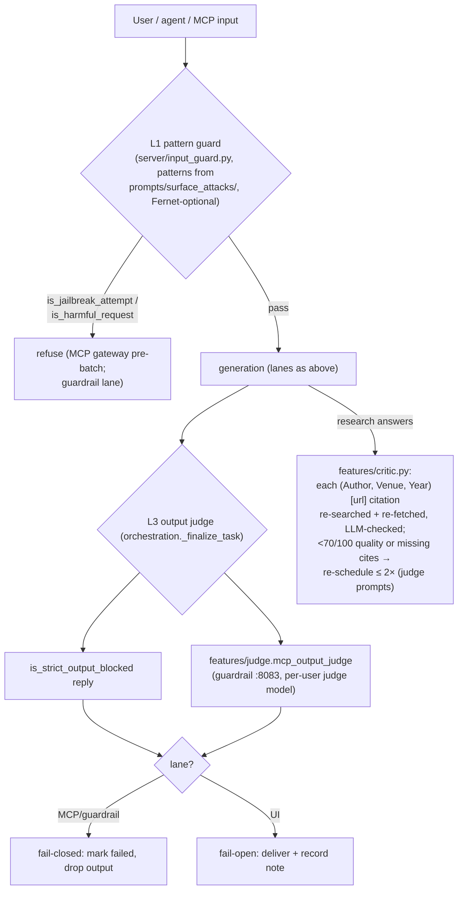
