# Architecture — Local AI

Deep-dive into the runtime design of the chat engine and its companion
services. For setup, SSO enablement and a module map, see the
[README](README.md); the manual regression plan lives in
[TEST_STEPS.md](TEST_STEPS.md) (section numbers below are referenced there).

The engine's implementation lives in `server/` + `server/features/`;
`chat-webui.py` is the entrypoint that owns all shared state. Feature modules
never bind shared names at import — they resolve `M.<name>` at call time
through the `state.register_entrypoint(...)` proxy, which is what keeps
per-test monkeypatching of `chat-webui.<name>` working everywhere.

## System Design

### 1. Infrastructure & Network

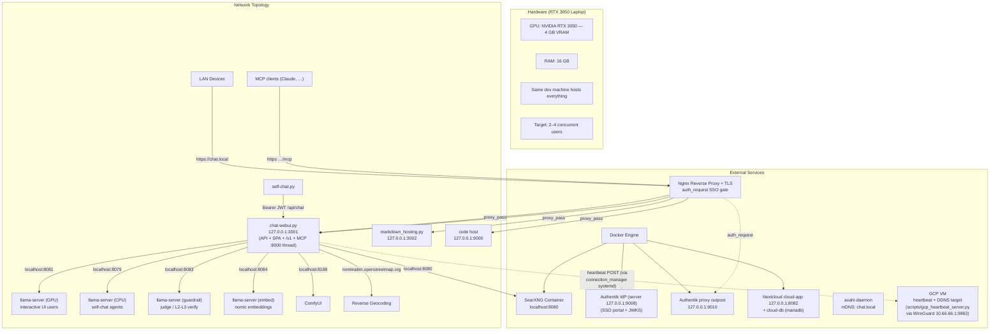

### 2. Code Layout & Build

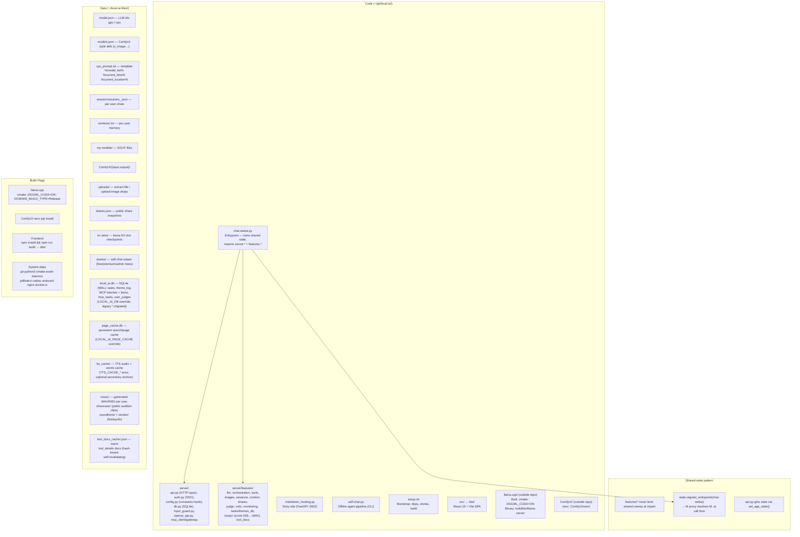

### 3. Runtime Constants & Locks

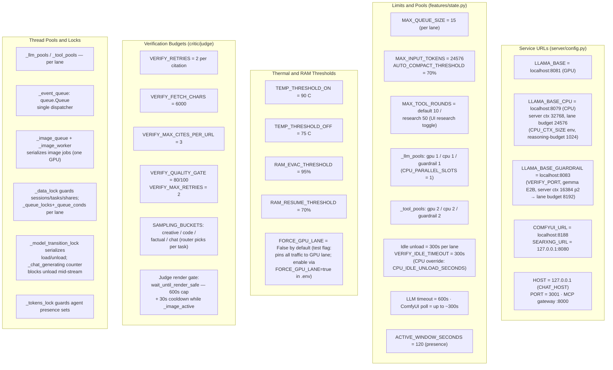

### 4. Server Startup

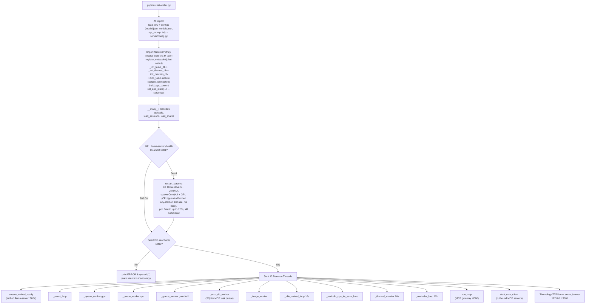

CPU (8079) and guardrail (8083) llama-servers are **lazy**:
`ensure_llama_server` / the MCP gateway start them on first
use; the embed server (:8084) starts on its own eager thread instead.
`_idle_unload_loop` unloads the CPU/guardrail models after 300s idle
(CPU override: `CPU_IDLE_UNLOAD_SECONDS`).

The DDNS + GCP heartbeat component (`connection_manager.py`) is **not** a
chat-webui thread — it runs as its own systemd service
(`scripts/connection-manager.service`, `Wants=wg-quick@wg0.service`).

### 5. Model State Machines

Three independent state machines — one per llama-server lane.

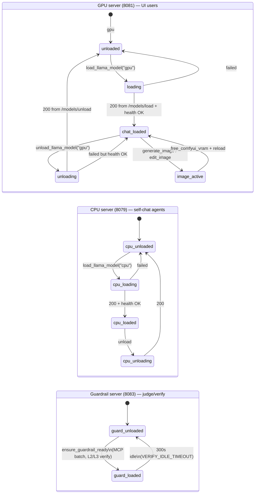

Image generation unloads the **GPU** and **guardrail** models for VRAM (ComfyUI)
*and* evicts the **CPU** model for RAM — the eviction is immediate (images don't
wait on the slow CPU lane: the render's up-front wait is scoped to the
gpu/guardrail VRAM lanes), and a round the unload force-kills is requeued to
resume after the render (see [HARDENING.md](HARDENING.md) §3-4). Per-lane idle timestamps (`_last_llm_use`,
`_cpu_last_llm_use`, `_guardrail_last_llm_use`; CPU governed by
`CPU_IDLE_UNLOAD_SECONDS`) drive independent unloads. On unload the KV
cache is checkpointed to `kv-slots/` (`--slot-save-path`, per-session
`_session_kv`) and restored after reload, so long conversations don't re-prefill.
A render eviction that kills a CPU round mid-stream can make that unload save
time out on the busy slot; a background **periodic saver**
(`_periodic_cpu_kv_save_loop`, `CPU_KV_SAVE_INTERVAL_SECONDS`, default 120 s)
keeps a recent prefix cached so the requeued round resumes from it rather than a
full re-prefill.

### 6. REST API Endpoints (`chat-webui` :3001)

```mermaid
graph TD
    Client([User Client])

    subgraph AuthEndpoints ["Auth (SSO)"]
        Client -->|"Browser: nginx auth_request → SSO portal"| SSO["X-Authentik-* forwarded upstream\n(Username/User, Groups/Group, Email, Name, UID)"]
        Client -->|"GET /api/check-auth"| CheckAuth["identity_from_headers →\n{authenticated, username, role, email}"]
        Client -->|"Agents: Authorization: Bearer <JWT>"| Bearer["Verify vs Authentik JWKS (issuer enforced,\naud not verified, 300s cache, fail-closed)\nserver/auth.py)"]
        Client -->|"Heartbeat presence"| Presence2["No server session to end;\n/api/leaving only marks heartbeat stale"]
    end

    subgraph SessionEndpoints ["Sessions"]
        Client -->|"POST /api/sessions"| NewSession["Create UUID session"]
        Client -->|"GET /api/sessions"| ListSessions["List user sessions (updated desc)"]
        Client -->|"GET /api/sessions/:id/messages"| GetMessages["Messages + token_estimate"]
        Client -->|"PUT /api/sessions/:id"| RenameSession
        Client -->|"DELETE /api/sessions/:id"| DeleteSession["Delete + cleanup output/upload images\n+ KV slots + TTS audio (share-protected refs kept)"]
    end

    subgraph ChatEndpoints ["Chat & Tasks"]
        Client -->|"POST /api/chat\n{session_id, message, image?, audio?,\nresearch?, cpu?, mode?, no_tools?, peer_review?\n+ always client_timestamp}"| Chat["→ {task_id}, queued per lane"]
        Client -->|"GET /api/status/:task_id"| Poll["status/message/response/tools_used/image"]
        Client -->|"GET/POST/PUT/DELETE /api/tasks"| Tasks["To-dos + reminders (SQLite;\nmanage_tasks ops; reminder cols)"]
        Client -->|"GET /api/themes"| Themes["Theme log + stats (UNIQUE scope+combo_hash\ndedup; track_theme ops)"]
        Client -->|"GET /api/model-status"| ModelStatus["model, tps, overheated, gpu_temp,\nram_evacuating, max_context, reminders"]
        Client -->|"POST /api/cancel/:id"| CancelChat["Cancel queued/in-flight task"]
    end

    subgraph ShareEndpoints ["Shares"]
        Client -->|"POST /api/shares · GET /api/shares\nDELETE /api/shares/:token[?purge=1]"| Shares["Assistant-only + owner-only snapshot\n(whitelist copy; _reasoning never stored)\nrevoke returns {session_exists, purged}"]
        Client -->|"GET /s/:token (SPA page)"| SharePage["Public read-only view\n(copy-link button; metadata hidden)"]
        Client -->|"GET /api/public/share/:token\n+ /image/:path + /file/:path\n+ POST .../tts (snapshot-only audio)"| ShareAPI["Snapshot JSON + scoped image/file serving\n+ scoped TTS (no auth, no client text)"]
        Client -->|"GET /api/public/music[/showcase]\n+ /api/public/music/:file"| Showcase["Unauthenticated music showcase page\n+ audition clips (music/showcase/)"]
    end

    subgraph UtilityEndpoints ["Utility"]
        Client -->|"POST /api/extract-file · POST /api/upload-image"| Uploads["Save to uploads/ → {url,name}"]
        Client -->|"GET /api/image/:id"| ImgEdit["Serve working image"]
        Client -->|"POST /api/location"| SetLocation["Nominatim reverse geocode"]
        Client -->|"GET/POST /api/user-context"| UserCtx["read/append; overwrite = admin only"]
        Client -->|"POST /api/tts · POST /api/tts-words"| TTS["md→speech cleanup → lang detect\n(en/es Piper, hi/te/bn/kn edge-tts)\nchunked <=1800 chars -> two-tier cache\n+ <key>.words.json; highlight offsets use\ntrue chunk audio durations (no drift)"]
        Client -->|"POST /api/internal/tts"| InternalTTS["Loopback-only + TTS_INTERNAL_TOKEN\n(story-page proxy; blank disables)"]
        Client -->|"GET /api/active-users · POST /api/leaving"| Presence["Active window tracking"]
        Client -->|"GET /output/… · GET /uploads/…"| ServeFiles["Identity + ownership-gated\nfile serving (resolve_image_file)"]
    end

    subgraph OpenAIEndpoints ["OpenAI-compatible /v1/* (Bearer OPENAI_API_KEY)"]
        Client -->|"GET /v1/ · GET /v1/models · /v1/models/:id"| V1M["Model list/retrieve"]
        Client -->|"POST /v1/chat/completions"| V1C["Non-stream + SSE streaming,\nincremental tool_calls, multimodal image_url"]
    end

    subgraph SPA ["Static / SPA Serving"]
        Client -->|"GET / · /s/:token · fallback"| SPAIndex["dist/index.html; assets from dist/"]
    end
```

### 7. Chat Ingress & Lane Routing

Tasks submitted by `MCP_USER` (the MCP service account) over `/api/chat` are
flagged `_mcp: true` at admission (api.py), so the pipeline treats them exactly
like gateway-admitted MCP tasks — most importantly the **fail-closed L3 output
judge**. The flag rides through the queue's `start` event: the RAM/thermal
pause paths rewrite queued task dicts down to a minimal placeholder, so the
queue entry — not the pre-created task dict — is the source of truth for the
flag.

### 8. Queue Workers (one per lane — gpu / cpu / guardrail)

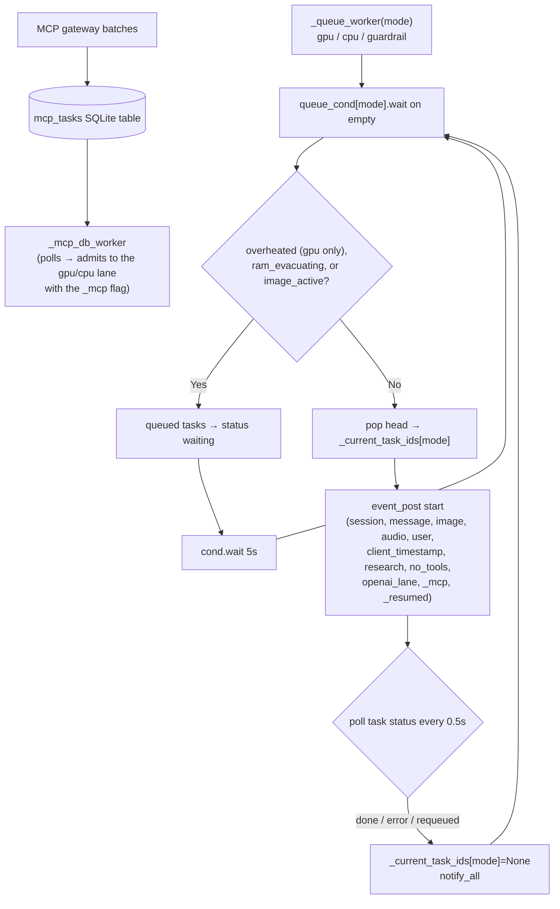

The human/agent lanes never wait behind each other. A third `_queue_worker`
runs for the **guardrail lane** — it carries judge-eligible work (MCP-admitted
tasks, self-chat theme-judge rounds) that executes on the guardrail server
(:8083). MCP chat tasks arrive through the SQLite queue via `_mcp_db_worker`
(routed onto the gpu lane by default, cpu when flagged) carrying `_mcp: true`;
the **guardrail server** (:8083) is where their L2/L3 judge calls execute —
generation stays on the gpu/cpu lane.

Tasks requeued by an emergency RAM evacuation (`_evacuate_ram`) ride the same
loop with two extra pieces of state: the task status becomes the **non-terminal
`requeued`** (so the UI keeps polling instead of seeing an error) and the queue
entry carries **`_resumed: true`**. The worker releases on `requeued`, picks the
entry back up once the servers are back, and the `start` event then skips
`prepare_session` — the user message (plus any tool trail and steering turns
from the interrupted attempt) is already in the session, so a resume never
duplicates the user turn in the chat.

The same `requeued`-with-`_resumed` path survives an image render: a CPU round
killed by the render's eviction is requeued to the front of its lane and
regenerated once ComfyUI finishes (see HARDENING.md §4).

### 9. Event Loop Pipeline (features/orchestration.py)

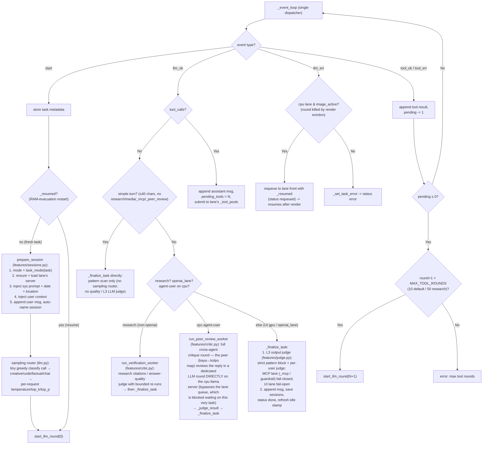

### 10. LLM Worker (features/llm.py)

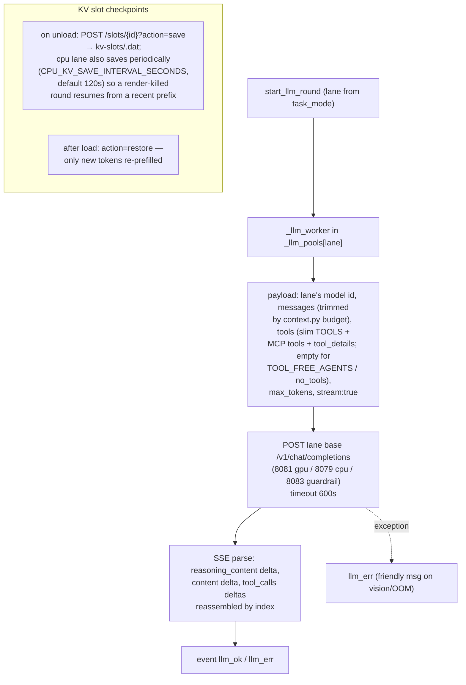

**Stable prompt prefix & warm tool docs (`llm._append_turn_context`,
`features/tool_docs.py`)** — the session's `system` message (message[0]) holds
only *stable* content: system prompt base + `<user_context>` + extra prompts.
Date/location (`<current_info>`), the research directive and cached tool docs
are appended per round as a trailing `system` block at the END of the payload
copy (never stored), so the prompt prefix — system block + history — stays
byte-identical turn over turn and KV checkpoints / `--cache-reuse` actually
hit. `_prepare_session` rewrites message[0] only when its stable content
changed (prompt hot-reload, user-context update) and then invalidates the
session's KV on both chat lanes. Related machinery: `get_sys_content()`
rebuilds `SYS_CONTENT` when `sys_prompt.txt`'s mtime changes (no restart
needed for prompt edits); `read_user_context` memoizes per user keyed on
`(mtime, size)`; and `tool_docs` persists each user's `tool_details` fetches
in `tool_docs_cache/<user>.json` keyed by a content hash of the live
`TOOLS_DETAILED` entry — later sessions whose request matches the tool's
keyword gate (`WARM_TRIGGERS`) get the docs injected without an LLM round,
and stale hashes silently re-fetch. A `[music-directive]` line rides the same
tail when the current request asks for music and none has been rendered,
keeping the small chat model's `generate_music` calling deterministic.

### 10.5 Archival Compaction (Pensieve — `features/pensieve/`)

Before the payload reaches any lane, `prepare_context_for_llm`
(`features/context.py`) runs Pensieve, a **deterministic, embed-free context
archival layer**. It is not the classic LLM summarization — it moves the
oldest conversation blocks out of the active context and into SQLite, leaving
a compact `[#id: topic (n messages)]` marker the model can recall on demand.

- **Block model.** A *block* is an unbreakable fused chain: a `user` message,
  or an `assistant` message plus every immediately-following `role="tool"`
  result (one per tool call, in order), up to the next user/assistant/system
  message. The `system` message is never archived. Blocks are the atomic unit
  of archival.
- **Trigger.** When the token estimate crosses `RELEVANCE_WATERMARK_FRAC`
  (default 0.55) of the lane's prompt budget, Pensieve archives the **oldest**
  blocks beyond the keep-recent window (`RELEVANCE_KEEP_RECENT`, default 6) to
  SQLite (`~/local-ai-files/pensieve.db`) and swaps them for `[#id: …]`
  markers in the working copy. The **stored session is never mutated** — all
  work happens on copies — and the session's KV cache is invalidated when the
  effective prefix changes.
- **Recall.** The `memory_read` tool (`features/tools.py`) → `pensieve.retrieval.memory_read`,
  which takes either `memory_ids` (exact archived block ids, taken only from
  `[#id]` markers) or a `query` (keyword search), scoped to the current
  session's own archive.
- **Knobs** (`features/pensieve/distill.py`): `RELEVANCE_DISTILL` (on by
  default), `RELEVANCE_WATERMARK_FRAC`, `RELEVANCE_KEEP_RECENT`,
  `PENSIEVE_MAX_UNITS` (200), `PENSIEVE_BLOCK_MAX_CHARS` (12000),
  `PENSIEVE_TOPIC_MAX_CHARS` (120).
- **Relation to classic compaction.** Pensieve runs first; whatever remains
  below the budget is passed on. If a session still exceeds
  `AUTO_COMPACT_THRESHOLD`, the older LLM-summarization path
  (`compact_messages_copy` + `trim_messages_for_context`) still applies to the
  remainder (`features/context.py`).

### 11. Tool Worker (features/tools.py)

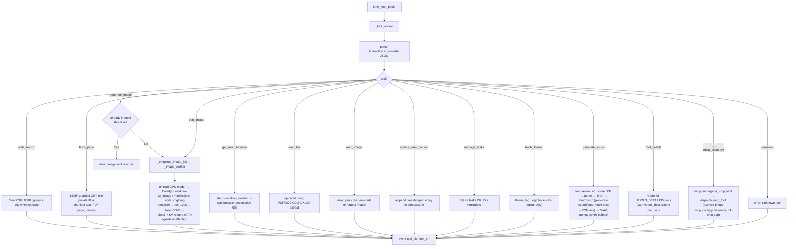

Outbound MCP tools (`mcp_config.json` servers — e.g. `codebase-search`, the
`codebase-memory-mcp` knowledge graph over `/home/palash/git`) are merged into
the wire tool list per session (`features/llm.py`; cache keyed on
`mcp_manager._tools_version`, so a server restart invalidates all sessions).
Dispatch is namespaced `<server>__<tool>`: `MCPClientManager.is_mcp_tool()`
gates the branch above and `dispatch_mcp_tool()` bridges the call onto the
client's asyncio loop (8k-char result cap). A repo yields no search results
until indexed once via `index_repository`; the graph persists under
`~/.cache/codebase-memory-mcp/`. The OpenAI lane pins `no_tools: true`, so only
UI/agent-lane tasks ever see these tools.

### 11.6 Music generation (features/music/)

A self-contained compose→render stack; no LLM or external service required at
render time. The chat-facing surface is the `generate_music` tool (score DSL →
playable WAV), plus a non-LLM `make music` chat shortcut
(`orchestration` start branch → `music.entry`) and a bulk-audition
**showcase** (`python -m server.features.music --showcase`).

- **DSL & arrangement.** `parse.py` compiles `@tempo/@genre/@mood/@section`
  directives and lane blocks (`[MELODY piano vol=90]`, note/chord/drum-hit
  tokens) via `theory.py` (pitch↔MIDI, GM program map incl. world-instrument
  aliases mapped to nearest GM colour). `random_arrange.py` composes full
  pieces from `genres.py`/`moods.py`/`harmony.py`/`rhythm.py`/`world_scales.py`
  (genre-authentic leads, tonic-cadence endings, song-form energy curves) —
  used by the shortcut, `--genre`, and the showcase.
- **Render.** `render.py` → `midi_out.py` (stdlib Type-0 writer: per-lane
  channels, drums→ch9, CC7 lane volumes, energy→CC11, legato articulation,
  release tail) → `fluid.py` renders with the vendored FluidSynth
  (`~/local-ai-files/music/vendor/`); `synth.py` is the numpy fallback and
  owns trailing-silence trimming (`trim_wav_silence`).
- **Per-voice soundfonts** (`fluid.py`): each lane's GM program maps to one
  SF2/SF3 — base `GeneralUser-GS.sf2`, with auto-discovered overrides
  (MuseScore_General.sf3 wins real strings/choir). Lanes are grouped per
  soundfont, each group rendered as its own `--fast-render` MIDI pass, and the
  WAVs summed (normalize-on-clip). Override map: `FLUID_SOUNDFONT_MAP` env
  (JSON `{program|"drum": path}`), base via `FLUID_SOUNDFONT`. Single group =
  classic one-pass render.
- **Named drum kits.** A percussion lane may name a kit (`[RHYTHM tabla]`);
  kits in `fluid.KIT_SOUNDFONTS` render from their own soundfont as a melodic
  group (regular channel, prog 0, GM-kit→file key `note_map`), mixed via the
   multi-pass machinery. Missing registered kit ⇒ render refuses
   ("not installed") — no rock-kit faking of tabla (provenance of
   `Tabla.sf2` in `soundfonts/PROVENANCE-Tabla.md`; the syllable→key map was
   settled by spectral analysis of one-shot renders, keys sound at K−12
   semitones over 60–82 — see `music/local/tabla-audition/`).
- **Outputs & meta.** WAV/MIDI land in `music/<user>/gen_<id>.*`; the task
  carries `music_file/music_score/music_url/music_levels/music_duration`,
  which `_finalize_task` attaches to the assistant message as
  `_music_url/_music_score/_music_levels` (UI player + lane meters + score
  fold-out). `duration_s` also feeds the critic's duration-claim gate (§13).
  Music files are share-protected and cleaned on chat deletion like images.
- **Showcase.** `showcase.py` renders every genre + instrument timbre once
  into the PUBLIC `music/showcase/` dir with `index.json`; served
  unauthenticated at `/api/public/music[/showcase]` (`api.py`) as a
  self-contained player page (`showcase_page.py`).

### 12. Resource Management (features/monitoring.py)

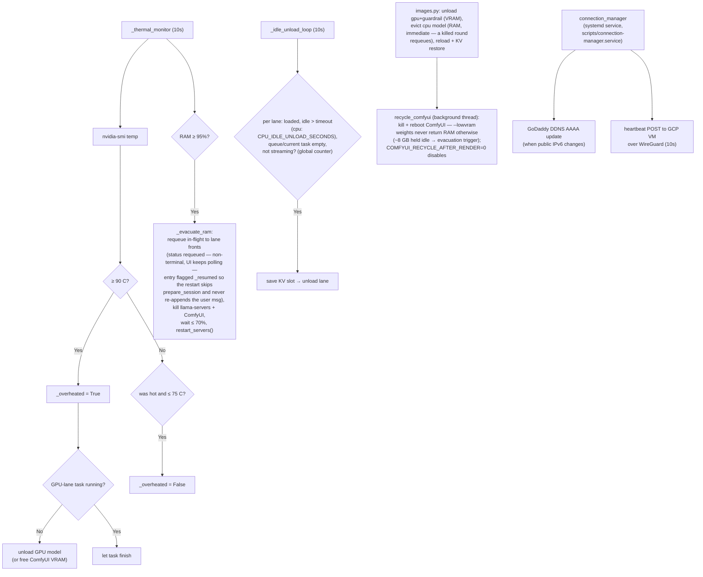

The idle check deliberately has **no runtime-based stuck-task watchdog** — the
earlier `TASK_STUCK_TIMEOUT` force-error was removed. A wedged lane is reclaimed
by RAM evacuation, thermal pressure, image-render takeover, or the idle gate;
long research rounds run to completion by design (HARDENING.md §5).

`connection_manager` (DDNS + GCP heartbeat) runs as its **own systemd service**
(`scripts/connection-manager.service`, `Wants=wg-quick@wg0.service`), reading
`.env`; it is **not** one of the chat-webui daemon threads listed in §4.

### 13. Moderation & Verification Pipeline

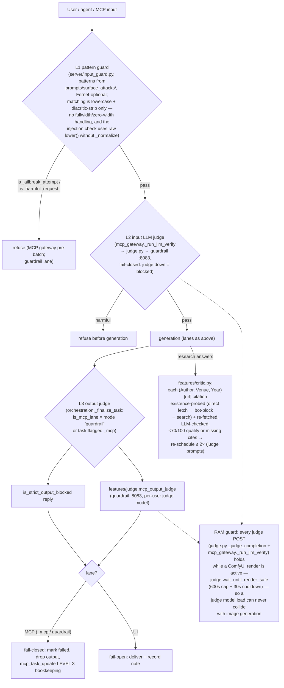

All judge LLM calls share one choke point (`judge._judge_completion`) and one
judge server (:8083). UI-lane extras beyond L3: the answer-quality judge (⚖
confidence chip, `llm_verify_answer_quality`) and the research citation judge
run via `run_verification_worker` with bounded re-runs; the former
input-request judge (pre-generation "request NN%" chip) was removed — its
load colliding with image renders was the main trigger of emergency RAM
evacuations.

**Deterministic requirement gates (`critic._requirement_mismatch`)** —
between the quality judge and delivery, a no-LLM pass compares the ANSWER and
the TASK against what was actually produced, and forces one bounded steering
re-run per mismatch: `image_needed`/`music_needed` (the request *asks for*
one — verb-proximity regexes, so a topic mention like "what sound does a
santoor make" never triggers; anaphoric reuse like "with the same image" is
satisfied by the session's prior artifact), `image_claimed`/`music_claimed`
(answer claims generation while this task rendered nothing — catches
parse-failed lies like "The Santoor piece has been generated"), and
`duration_claimed` (answer states a length > 1.5× the tool's real
`duration_s` + 10s — catches "…about a minute if looped"), `score_errors`
(the DSL compiled but the parser dropped tokens, so the track is broken —
the retry embeds the rejected tokens verbatim), and `length_mismatch` (an
explicit user duration — digits or spelled-out "about a minute" — vs a
rendered `duration_s` outside 0.6×–1.8× of the target). The music DSL docs
enforce the same contract upstream: minimum texture (MELODY+HARMONY always,
BASS+RHYTHM when rhythm is asked, single lane only for explicit solos) and
LENGTH MATH (bars ≈ seconds × BPM ÷ 240, sections sum to the target ±20%). Verdicts from all
judges, plus the re-run history, are appended to the final answer's reasoning
block as a `### Guardrail verification` trail (`critic._verification_addendum`).
Two finalize-side companions (`orchestration`): anaphoric artifact
**carry-over** (re-attaches the referenced prior `_image_url`/`_music_url`
card onto the new message) and pasted-path **stripping** (text lines that
merely restate a path the UI already renders as a card are removed; lines
whose artifact is *not* attached are kept). Assistant messages that contain
tool calls plus scratch prose are flagged `_draft`: kept in the LLM history,
hidden by the UI, and folded into the final answer's reasoning at finalize.

**Critic call budget & reasoning fallback** — `critic._critic_completion`
issues the critic's LLM calls with `max_tokens=2048` (retry doubles to 4096).
Reasoning-capable chat models can burn the whole token budget inside
`reasoning_content` before emitting the verdict, which used to surface as
`[critic] LLM call failed … empty content in response` and silently dropped
every citation verdict (fail-open). On empty `content` the critic now judges
on the reasoning text instead — the same fallback the L2 judge implements in
`mcp_gateway._judge_call`.

**Citation existence probe** — for a URL the research run never retrieved,
`critic._citation_exists` decides "does this source exist at all?" in this
order: (1) direct fetch of the URL (any page content → exists); (2) a
bot-block in the fetch error (403/405/429/forbidden/captcha/cloudflare) →
treated as existing but unfetchable; (3) the original SearXNG same-URL search,
last resort only. The search-only probe was removed as the primary check
because search indexes rarely return deep links (PMC article pages, hospital
blogs) verbatim, which branded real sources "likely fabricated".

**L2 judge precision caveat** — the input judge is a small model and can
false-positive on imperative technical phrasing: "Debug this Rust program …
identify the bug … it misbehaves at runtime" was classified HARMFUL while
near-identical "This Rust code fails to compile … identify the exact bug"
prompts passed. The L2 verdict path itself is fail-closed and working as
designed; benign code-debugging workloads hitting `LEVEL 2 LLM VERIFICATION
FAILED` are a judge-prompt/model-precision issue, not an infra failure
(check the `[guardrail][L2] raw verdict:` log line to distinguish).

**Confidence-gated restart ("start from scratch")** — research and UI
generation answers whose verification outcome lands below the confidence bar
get a full fresh re-run: the original message is re-submitted as a **new
task** through the normal send path (a new user turn is appended and a fresh
research/tool round starts), unlike the in-task `_reschedule` retry, which
appends a hidden `_steering` turn and re-runs within the same task's bounded
counters. Open issues being worked: the restart turn is visible in the UI as
a duplicate user message, and the per-task retry counters do not carry over —
a persistently low-confidence answer can chain restarts (each costing a full
research round) with no global cap.

**Agent (Kaya/Kolpo) verification** — two more layers on the CPU lane, both
fail-open (they never block delivery):

- *Offline story pipeline* (`self-chat.py`): after the deterministic gate, the
  re-opened **editor line** grades the story against the task/genre checklist
  (`VERDICT: CLEAN|FLAGGED / CONFIDENCE: NN/100 / FLAGS:`). FLAGGED stories are
  discarded wholesale — sessions deleted, story files removed — and the
  conversation restarts from scratch (up to `SELF_CHAT_EDITOR_RESTARTS`, then
  RED with the flags). A CLEAN story below the confidence threshold
  (`editor_min_confidence` task key / `SELF_CHAT_EDITOR_MIN_CONFIDENCE`, default
  70) triggers one extra cross-critique revision + one re-review; pre/post
  confidence is recorded in `.moderation.json` (written for GREEN too, so the
  story site shows a badge with the confidence number for every story).
- *Online agent replies* (cpu lane): `run_peer_review_worker` runs a full
  cross-agent critique round (`AGENT_PEER_MAP`, default kaya↔kolpo) — the peer
  reviews the reply in a dedicated LLM round directly on the cpu llama-server
  and the PEER VERDICT / CONFIDENCE verdict becomes the reply's confidence
  chip. Both layers resolve the per-agent judge model from the `user_judges`
  table (`resolve_judge_model`), so bigger verification models can be assigned
  to kolpo/kaya out-of-band.
