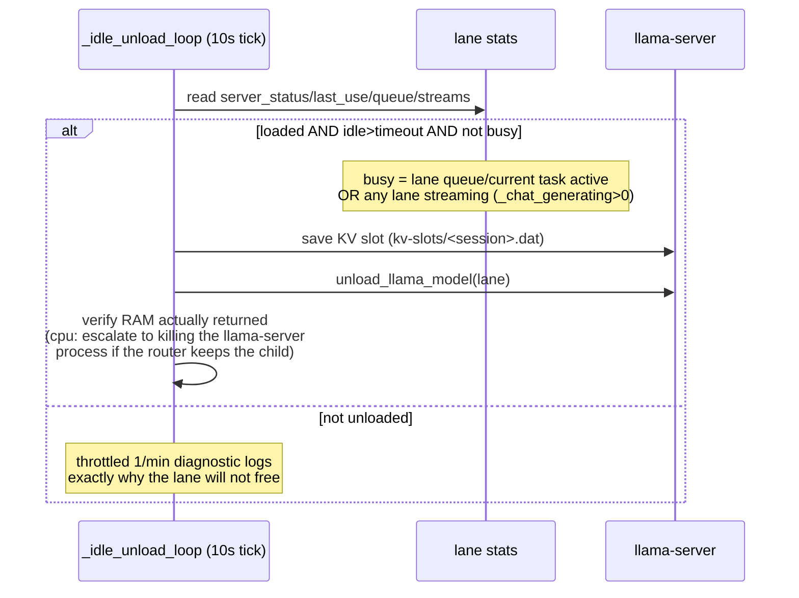

# Hardening — Lane Isolation, Idle-Unload & Render Resilience

How the engine keeps interactive UI users, long-running CPU agents (research /
Kaya-Kolpo), image generation and the judge lanes from killing each other over
shared VRAM and RAM — and what happens to a task whenever the app makes one of
its servers go away.

For the full runtime design see [ARCHITECTURE.md](ARCHITECTURE.md); the manual
regression steps for everything below live in
[TEST_STEPS.md](TEST_STEPS.md) (`## J`). This document is the resource model
behind both.

## 1. What contends for what

Three kinds of scarce resource, protected by three mechanisms:

| Resource | Consumers | Guard |
|---|---|---|
| **GPU VRAM** | GPU lane (UI users), guardrail lane (judge/L2-L3), ComfyUI renders | `_wait_chat_generating_clear(lanes=("gpu","guardrail"))` + `_image_active` gate |
| **System RAM** | CPU lane's gemma4-12b (~9 GB), ComfyUI models, KV slots | `_evacuate_ram` (95 %) + render-time CPU eviction |
| **Rest of the box** | thermal state, whole-box RAM % | `_thermal_monitor`, `_evacuate_ram` |

Lanes are otherwise independent workers (`_queue_worker` per lane, own
`_llm_pools`/`_tool_pools`, own `_task_queues`): a UI user on the GPU lane never
waits behind a CPU agent, and vice-versa.

## 2. Idle-unload (Phase 0)

Every lane's llama-server unloads its own model once its **own** lane has been
idle past a timeout. Idle is measured from the last LLM completion on that lane
(`_last_llm_use` gpu / `_cpu_last_llm_use` cpu / `_guardrail_last_llm_use`).

| Lane | Timeout |
|---|---|
| gpu | fixed 300 s |
| cpu | `CPU_IDLE_UNLOAD_SECONDS` (default 300, `.env` test value 15) |
| guardrail | fixed 300 s |



Key properties:

- **A running task cannot be unloaded underneath.** The busy gate counts the
  lane's `_current_task_ids`/queue *and* the streaming counter, so idle-unload
  only fires on a genuinely quiet lane.
- **Before any unload the KV cache is checkpointed** (`POST /slots/{id}?action=save`)
  and restored on the next load, so long conversations do not re-prefill.
- **The CPU unload is verified, not assumed**: `_verify_cpu_unload` measures free
  RAM before/after and, if the llama-server router refuses to release the child,
  kills the process. `cpu_last_idle_freed_mb` in `/api/model-status` records the
  win.
- **Today the stream gate is global**, not per-lane: `any_streaming =
  _chat_generating > 0` counts all lanes. Accepted limitation — a slow CPU round
  mid-generation can delay a GPU-model free until that round ends (see §6).

## 3. The render ↔ LLM handshake (`_image_active`)

ComfyUI needs the GPU (VRAM) *and* the ~9 GB of RAM the CPU gemma normally
holds. Image generation therefore orchestrates every lane:

```mermaid
sequenceDiagram
    participant GH as generate_image
    participant LC as _wait_chat_generating_clear
    participant Q as lane workers
    participant C as CPU gemma
    participant U as ComfyUI
    GH->>LC: wait for GPU/guardrail lanes to stop streaming (600s cap)
    GH->>GH: _image_active = True
    GH->>Q: lanes pause (queued tasks -> status "waiting",<br/>new loads blocked by _image_active gate)
    GH->>GH: unload gpu + guardrail llama-servers (VRAM)
    GH->>C: evict CPU model for RAM<br/>(immediate; interrupted rounds requeued)
    GH->>U: ComfyUI workflow (poll 120s)
    U-->>GH: render complete (VRAM freed)
    GH->>GH: _image_active = False
    GH->>Q: lanes resume; gpu/guardrail reload + KV restore<br/>(~5s cooldown); ComfyUI recycled in background
```

Every layer of this is about **not silently losing a live round**:

- The GPU/guardrail side waits for in-flight inference before touching VRAM
  (`generate_image` starts with `_wait_chat_generating_clear(lanes=("gpu","guardrail"))`).
- The CPU side does **not** drain: it evicts immediately so the render starts
  fast, and any round the unload force-kills is **requeued** (Fix 2) to resume
  after the render. Images stay ~2 min even while research is mid-round.
- A render that lands on a round mid-stream (the router's 10 s grace can never
  finish a minutes-long prefill) does **not** error the task — it requeues it
  (next section). The unload's own save usually times out on a busy slot, so a
  **periodic KV snapshot** (`CPU_KV_SAVE_INTERVAL_SECONDS`, default 120 s) keeps
  a recent checkpoint: the resumed round restores that and re-prefills only the
  tokens added since the last snapshot, not the whole context.

## 4. What happens to a running task when a server goes away

| Stop cause | Where it's triggered | Running task outcome |
|---|---|---|
| **Idle-unload** | `_idle_unload_loop` | Never fires mid-task — busy gate holds. Nothing to resume. |
| **Render eviction** | `images.generate_image` → `evict_cpu_model_for_image` | CPU eviction is immediate (images never drain-wait on the CPU lane). A round that happens to be mid-stream is force-killed by the unload and **requeued** (Fix 2) to resume after the render. |
| **RAM evacuation (≥95 %)** | `_evacuate_ram` | Task requeued to the front of its lane with `_resumed=true` *before* the servers are killed; resumes on restart. |
| **Thermal (≥90 °C)** | `_thermal_monitor` | GPU lane pauses (never kills its server). CPU lane unaffected. |
| **Server dies between rounds** | crash/kill/OOM | Self-heals — the next round's `load_llama_model` re-spawns the server and continues. |
| **Server dies mid-generation** | crash/kill/OOM (out of app control) | Round errors → task marked `error`. **Known gap**: no auto-resume (see §6). |

### The render-interrupt requeue (Fix 2)

When a CPU round's `llm_err` fires while `_image_active` is true, the event loop
rebuilds the queue entry from the task dict and pushes it to the **front** of
the CPU lane with `_resumed=true`:

- status becomes the non-terminal `requeued` (the UI keeps polling — same
  convention as `_evacuate_ram`),
- the next `start` event sees `_resumed` and **skips `_prepare_session`** — the
  user message and the whole tool trail are already in the session, so the
  resume regenerates only the interrupted round and never duplicates a turn.

## 5. Why there is no stuck-task watchdog (Option B)

A previous iteration force-errored any lane task running longer than a
`TASK_STUCK_TIMEOUT`. That was withdrawn: multi-minute CPU prefills, tool-heavy
research rounds and image renders all legitimately keep a task "working" far
longer than any fixed budget — a runtime-based watchdog either kills healthy
work or is tuned so loose it never fires. `TASK_STUCK_TIMEOUT` was removed
(env, constant, watchdog thread).

A wedged lane is instead reclaimed by the mechanisms that already exist:

- RAM evacuation (95 % threshold) re-queues in-flight work and restarts servers;
- thermal pressure pauses the GPU lane;
- image rendering takes over VRAM/RAM; and
- the idle gate plus the render eviction keep models from being pinned forever.

The trade about "slow but steady" is deliberate: long CPU research now runs to
completion rather than being recycled mid-answer.

## 6. Known limitations (accepted)

- **Global stream gate.** `_idle_unload_loop` treats *any* lane streaming as
  busy, so a CPU round mid-generation can delay the GPU model's 300 s idle
  free. Harmless for correctness; a per-lane counter would cap GPU free at 300 s
  regardless of CPU activity. Not a concern, left as-is.
- **RAM-evac mid-generation MCP latch.** If `_evacuate_ram` kills the server
  while an MCP task's round is streaming, the dying round's `_set_task_error`
  latches `status=error` into the MCP tasks DB even though the task was already
  requeued. In-memory flow still resumes. Not a priority.
- **CPU render eviction (by design).** The render never waits on the CPU lane:
  a round mid-stream when the eviction fires is force-killed and requeued (Fix 2),
  so the render resumes it after ComfyUI finishes. A round that starts in the
  sub-second gap between the eviction kill and the unload's `finally` is equally
  safe — the same requeue path catches it. Nothing is lost; the periodic
  snapshot (default 120 s) limits the resume's re-prefill cost to what changed
  since the last save, avoiding a full-context re-prefill when the eviction's own
  save times out on a busy slot.
- **CPU throughput.** gemma4-12b on the CPU lane runs ~10-16 tok/s prefill /
  ~4-5 tok/s generation. Research is expected to be slow-but-steady there; keep
  interactive users on the GPU lane.

## 7. Configuration knobs

| Knob | Where | Default / current | Meaning |
|---|---|---|---|
| `CPU_IDLE_UNLOAD_SECONDS` | `.env` | **15 (test) — set 300 before live** | CPU-lane idle unload timeout |
| `CPU_KV_SAVE_INTERVAL_SECONDS` | `.env` | `120` (`0` disables) | CPU-lane periodic KV snapshot; keeps an image-evicted round resumable from a recent prefix instead of a full re-prefill |
| `IMAGE_RENDER_RAM_HEADROOM_MB` | config | `4000` | Free-RAM headroom (MB) that skips CPU-lane eviction on an image render when already satisfied |
| `SELF_CHAT_MODE` | `.env` | `cpu` | Lane for self-chat agents (research defaults here) |
| `RAM_EVAC_THRESHOLD` / `RAM_RESUME_THRESHOLD` | config | 95 % / 70 % | Whole-box evacuation hysteresis |
| `TEMP_THRESHOLD_ON` / `TEMP_THRESHOLD_OFF` | config | 90 °C / 75 °C | Thermal hysteresis (GPU lane pause) |
| `COMFYUI_RECYCLE_AFTER_RENDER` | `.env` | enabled | Recycle ComfyUI process after each render to return RAM |
| `FORCE_GPU_LANE` | config | test flag | Pin all traffic to the GPU lane |
| `MAX_QUEUE_SIZE` | state | 15 | Per-lane queue cap (503 beyond) |
| `TASK_STUCK_TIMEOUT` | — | **removed** | History only — see §5 |