# Local AI — Architecture

Self-hosted LLM + image generation stack on a single laptop (RTX 3050, 4 GB VRAM, 16 GB RAM).

## Quick Start

```bash
# 1. Clone and build
git clone <this-repo> ~/git/local-ai
cd ~/git/local-ai
bash setup.sh

# 2. Edit config files (required before first run)
nano ~/local-ai-files/model.txt        # set your LLM model name
nano ~/local-ai-files/models.json      # set ComfyUI model filenames
nano ~/local-ai-files/users.json       # set passwords

# 3. Download models into:
#    LLMs:     ~/local-ai-files/my-models/
#    ComfyUI:  ~/local-ai/ComfyUI/models/{checkpoints,clip,vae,unet,...}

# 4. Start services (in order)
~/local-ai/llama.cpp/build/bin/llama-server \
    --host 0.0.0.0 --port 8081 \
    --models-dir ~/local-ai-files/my-models/ \
    --n-gpu-layers 99 --no-kv-offload --ctx-size 32768 \
    --reasoning-budget 1120

cd ~/local-ai/ComfyUI && source venv/bin/activate && python main.py \
    --lowvram \
    --input-directory ~/local-ai-files/ComfyUI/input \
    --output-directory ~/local-ai-files/ComfyUI/output

cd ~/git/local-ai && python chat-webui.py
```

Access at `http://chat.local` or `http://localhost:3001`.

## 1. Infrastructure & Network

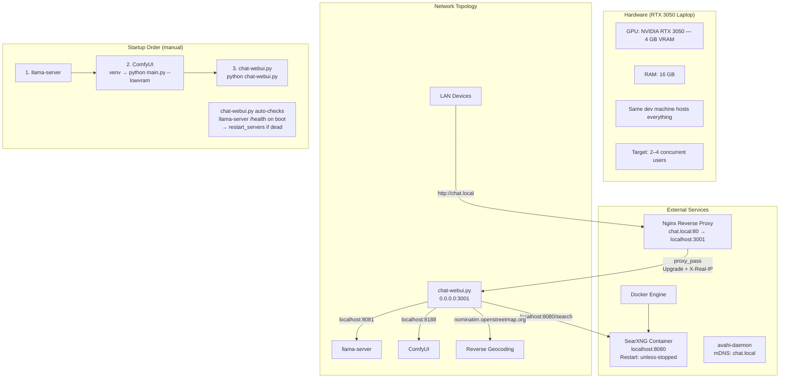

## 2. File Layout & Build

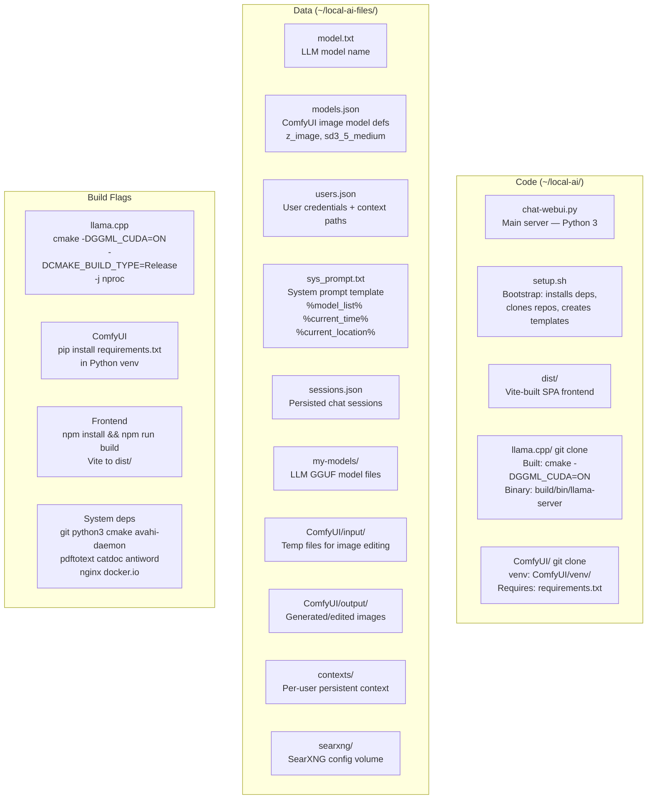

## 3. Runtime Constants & Locks

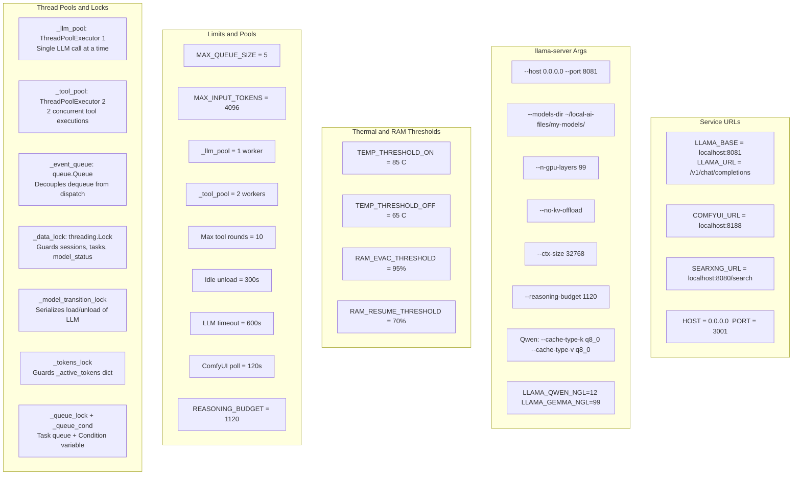

## 4. Server Startup

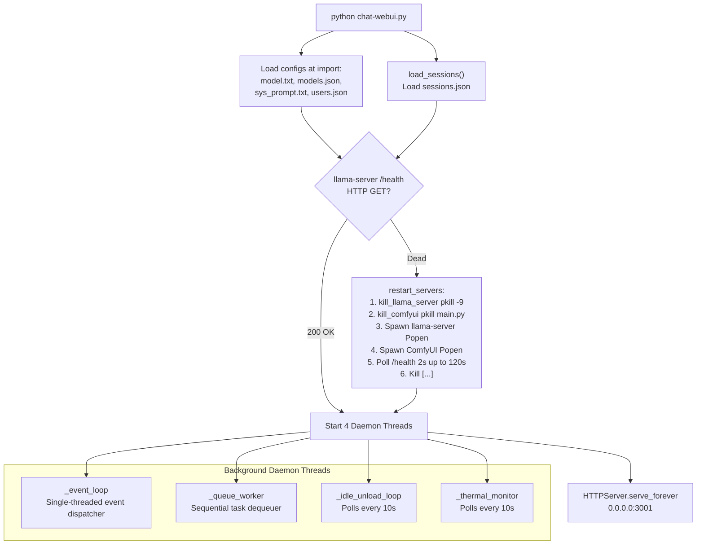

## 5. Model State Machine

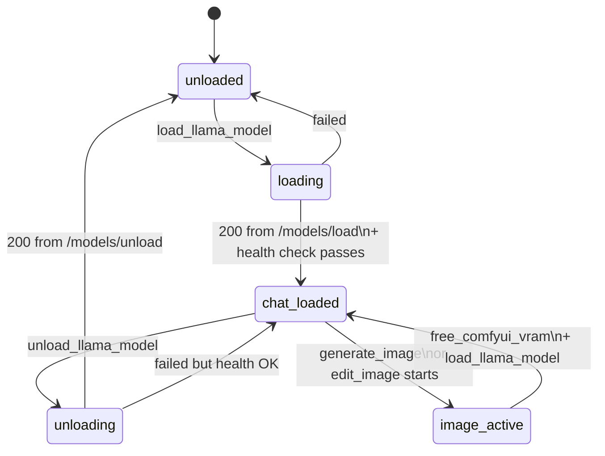

## 6. REST API Endpoints

```mermaid
graph TD
    Client([User Client])

    subgraph AuthEndpoints ["Auth"]
        Client -->|"POST /api/login\n{username, password}"| Login["Validate against users.json\nIssue UUID token to _active_tokens"]
        Client -->|"POST /api/logout\nX-Auth-Token"| Logout["Remove token"]
        Client -->|"GET /api/check-auth"| CheckAuth{"Token valid?"}
        CheckAuth -- Yes --> AuthOK["{authenticated: true, username}"]
        CheckAuth -- No --> AuthNO["{authenticated: false}"]
    end

    subgraph SessionEndpoints ["Session Management"]
        Client -->|"POST /api/sessions"| NewSession["Create UUID session\nStore in sessions_meta"]
        Client -->|"GET /api/sessions"| ListSessions["List user sessions\nSorted by updated desc"]
        Client -->|"GET /api/sessions/:id/messages"| GetMessages["Return messages\n+ token_estimate"]
        Client -->|"PUT /api/sessions/:id"| RenameSession["Rename session"]
        Client -->|"DELETE /api/sessions/:id"| DeleteSession["Delete session + cleanup\nassociated output images"]
    end

    subgraph UtilityEndpoints ["Utility"]
        Client -->|"GET /api/model-status"| ModelStatus["model_status, _last_tps\n_overheated, _gpu_temp"]
        Client -->|"POST /api/extract-file"| ExtractFile["PDF/DOCX/DOC/XLSX to text\nvia fitz/catdoc/antiword/openpyxl"]
        Client -->|"POST /api/location"| SetLocation["Reverse geocode via Nominatim\nstore _client_location"]
        Client -->|"GET /api/user-context"| GetUserCtx["Read user context file"]
        Client -->|"POST /api/user-context"| SetUserCtx["write / overwrite / read"]
        Client -->|"GET /output/:filename"| ServeImage["Serve generated images\nfrom ComfyUI output dir"]
    end

    subgraph SPA ["Static / SPA Serving"]
        Client -->|"GET /"| SPAIndex["Serve dist/index.html"]
        Client -->|"GET /*"| SPAAssets["Serve dist/ assets\nor SPA fallback to index.html"]
    end

    subgraph StatusPolling ["Status Polling"]
        Client -->|"GET /api/status/:task_id"| PollStatus["Return tasks id:\nstatus message response\n tools_used image etc"]
    end
```

## 7. Chat Ingress Flow

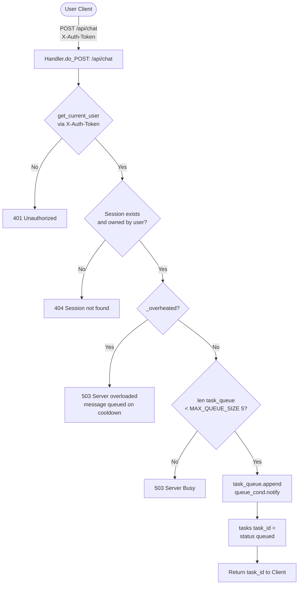

## 8. Queue Worker

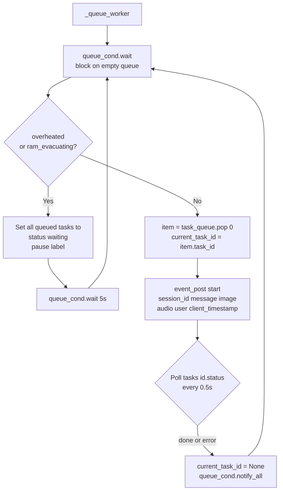

## 9. Event Loop Pipeline

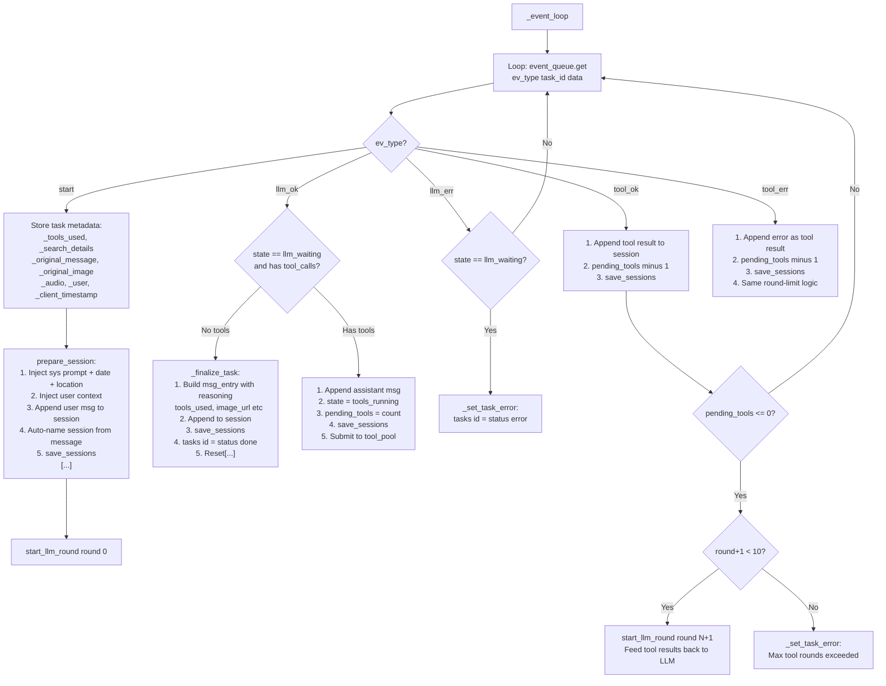

## 10. LLM Worker

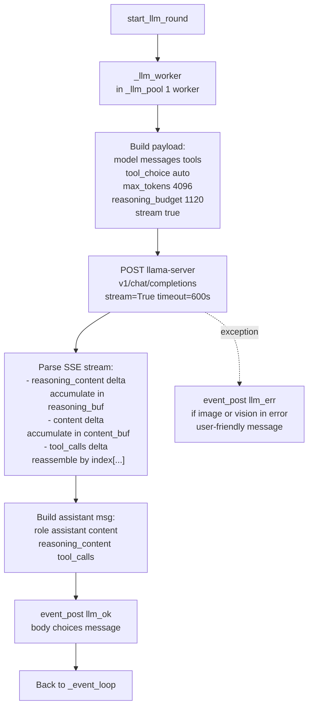

## 11. Tool Worker

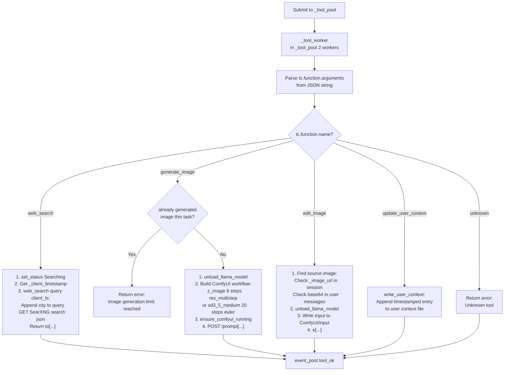

## 12. Resource Management

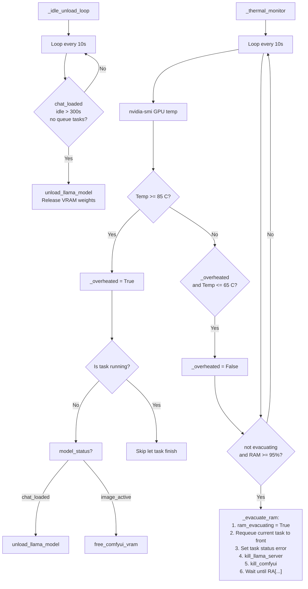
