# Local AI - LLM + Image Generation Setup

Self-hosted LLM + image generation stack on a single laptop (RTX 3050, 4 GB VRAM, 16 GB RAM).

## Requirements

- NVIDIA GPU with the driver working — check with `nvidia-smi`.
- **Host OS path:** CUDA toolkit (`nvcc`) needed to build llama.cpp. `setup.sh` installs
  it automatically if it's missing.
- **Dockerized path:** **NVIDIA Container Toolkit** on the *host* (for `--gpus`), plus
  CUDA toolkit *inside* the container (`setup.sh` installs it there too).

## Quick Start — Host OS

```bash
# 1. Clone and build
git clone <this-repo> ~/git/local-ai
cd ~/git/local-ai
bash setup.sh

# 2. Post-processing — download your models (setup.sh does NOT download them)
#    LLM (chat):   put a GGUF into ~/local-ai-files/my-models/
#                  model.json holds "gpu" (chat UI) and "cpu" (self-chat agents)
#                  model ids — edit it if you use other models
#    Image (z_image): copy these into ~/local-ai/ComfyUI/models/:
#      diffusion_models/z_image_turbo_bf16.safetensors
#      text_encoders/qwen_3_4b.safetensors
#      vae/ae.safetensors
#    (optional) nano ~/local-ai-files/users.json   # set passwords

# 3. Run — nothing else to configure
cd ~/git/local-ai && python chat-webui.py
```

Access at `http://chat.local` or `http://localhost:3001`.

`chat-webui.py` auto-starts the two llama-servers on boot if they're down, and
starts ComfyUI on demand, so no manual service startup is required. If you prefer
to run the services manually:

```bash
# GPU llama-server — interactive chat UI users (VRAM-backed)
~/local-ai/llama.cpp/build/bin/llama-server \
    --host 0.0.0.0 --port 8081 \
    --models-dir ~/local-ai-files/my-models/ \
    --n-gpu-layers 99 --ctx-size 32768 \
    --reasoning-budget 4096 \
    --no-mmproj-offload

# CPU llama-server — automated self-chat agents (RAM-backed, concurrent)
~/local-ai/llama.cpp/build/bin/llama-server \
    --host 0.0.0.0 --port 8079 \
    --models-dir ~/local-ai-files/my-models/ \
    --n-gpu-layers 0 --ctx-size 32768 \
    --reasoning-budget 4096 \
    --no-mmproj-offload

cd ~/local-ai/ComfyUI && source venv/bin/activate && python main.py \
    --lowvram \
    --input-directory ~/local-ai-files/ComfyUI/input \
    --output-directory ~/local-ai-files/ComfyUI/output
```

## Quick Start — Dockerized (GPU)

The repo ships a `docker-compose.yaml` that runs the same stack inside an
`ubuntu:24.04` container with GPU passthrough, with SearXNG as a sibling service.

```bash
# 1. Start services (SearXNG + ai-container with GPU + shared dirs)
docker compose up -d

# 2. Enter the container and run setup
docker exec -it ai-container bash
cd /root/git/local-ai
bash setup.sh

# 3. Post-processing — download models into the shared host dirs
#    (same list as the Host OS path, but the image models land in
#     ~/local-ai/ComfyUI/models/ on the HOST, which is mounted into the container)

# 4. Run — inside the container
cd /root/git/local-ai && python chat-webui.py
```

Access at `http://localhost:3001` (published from the container). Notes:

- **Requires the NVIDIA Container Toolkit on the host**; the compose already passes
  `--gpus` to the container.
- `setup.sh` auto-detects the container: runs without `sudo`, skips systemd/mDNS/nginx
  (not available in a container), skips starting SearXNG (provided by compose), and
  installs the CUDA toolkit inside the container if `nvcc` is missing.
- The container needs internet during setup (`apt`, `git clone`, `npm`, CUDA toolkit);
  the compose attaches it to `external-net`.
- Config/data dirs (`~/local-ai-files`) are shared with the host, so models and
  sessions persist across container restarts.

## Security & Deployment Notes

> **Intended scope: a private, trusted home deployment** — e.g. a household of a few
> users on a home LAN (this project targets ~2–4 concurrent users). The following
> limitations are **accepted risk** for that use case. This stack is **not** built for
> production, the public internet, or a shared LAN where many unknown users work —
> do **not** use it under those conditions.

- **File endpoints are unauthenticated.** `/output/...` (generated images) and
  `/uploads/...` (uploaded documents) are served without requiring a login token
  (`chat-webui.py` `do_GET`). Anyone who can reach port 3001 and knows a filename can
  download them. Do not upload sensitive files you wouldn't want shared on the LAN.
- **CORS is wide open.** Responses carry `Access-Control-Allow-Origin: *`
  (`chat-webui.py` `do_OPTIONS`/`send_json`). A malicious page on the LAN could call
  the API and read responses (login is still required via `X-Auth-Token`).
- **Default credentials.** A fresh `setup.sh` run creates `admin` / `admin`
  (`users.json`). Change it immediately — `nano ~/local-ai-files/users.json`.
- **Plaintext passwords.** `users.json` stores passwords in plaintext and compares them
  directly (`chat-webui.py` `/api/login`). Keep that file readable only by you
  (`chmod 600`).
- **No TLS/HTTPS.** Login tokens and chat content travel in plaintext. Fine on a
  trusted LAN; never port-forward 3001/8081/8079 without adding TLS in front.
- **No content guardrails.** The model outputs whatever the loaded model produces; there
  is no moderation or kid-safe filter in the stack. Choose your model accordingly and
  set expectations for anyone using it.
- **Third-party calls.** `fetch_page` and location lookup call external services
  (SearXNG backends, `nominatim.openstreetmap.org`), and optional TTS can use
  Microsoft `edge-tts` unless you configure the local Piper voices. If strict data
  residency matters, disable or replace these.
- **Compose exposes SearXNG on all host interfaces** (`8080:8080`), while the host path
  binds it to `127.0.0.1`. Bind it to localhost if you don't need LAN-wide search.

## System Design

### 1. Infrastructure & Network

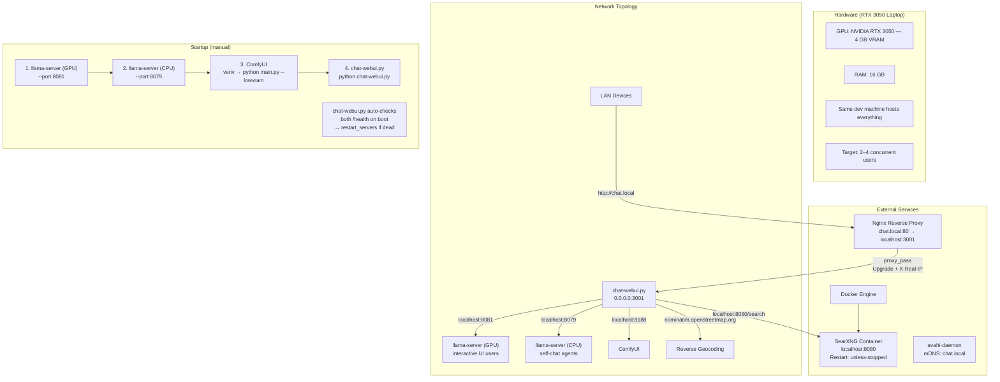

### 2. File Layout & Build

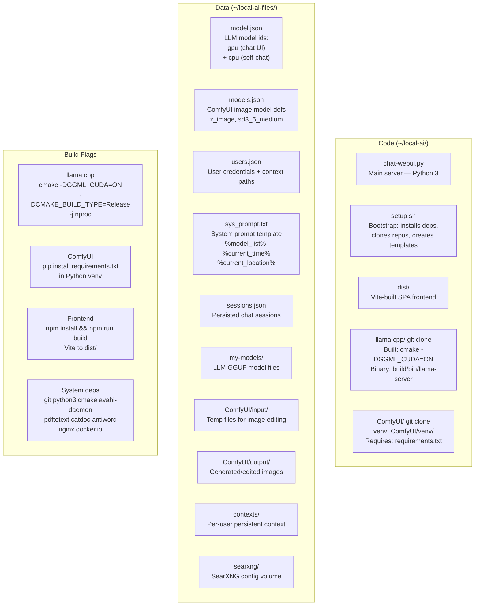

### 3. Runtime Constants & Locks

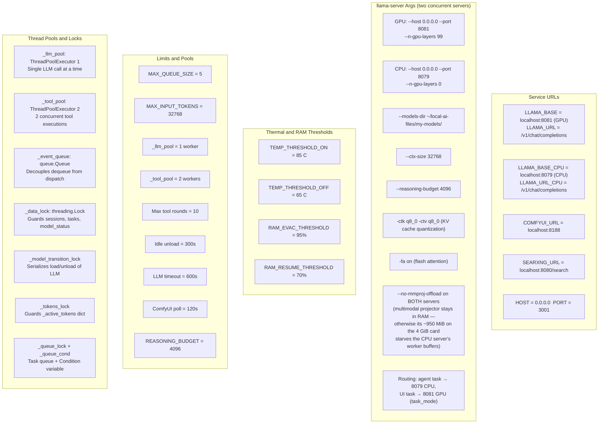

### 4. Server Startup

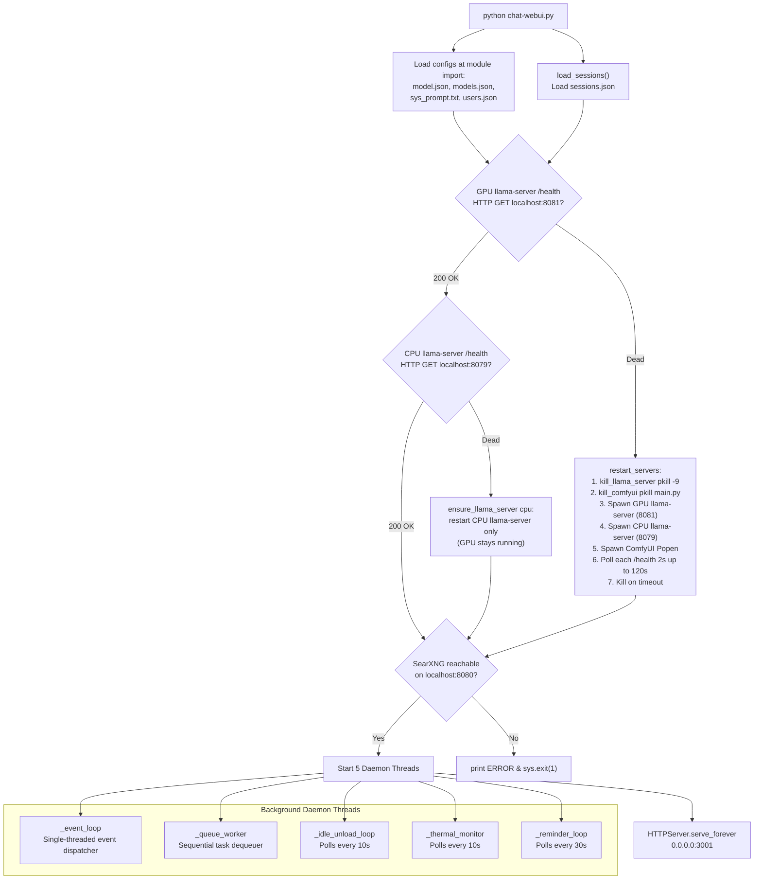

### 5. Model State Machine

Two independent state machines run concurrently — one per llama-server.

```mermaid
stateDiagram-v2
    direction LR

    state "GPU server (8081) — UI users" as G {
        [*] --> unloaded: gpu
        unloaded --> loading : load_llama_model("gpu")
        loading --> chat_loaded : 200 from /models/load\n+ health check passes
        loading --> unloaded : failed
        chat_loaded --> unloading : unload_llama_model("gpu")
        unloading --> unloaded : 200 from /models/unload
        unloading --> chat_loaded : failed but health OK
        chat_loaded --> image_active : generate_image\nor edit_image starts
        image_active --> chat_loaded : free_comfyui_vram\n+ load_llama_model("gpu")
    end

    state "CPU server (8079) — self-chat agents" as C {
        [*] --> cpu_unloaded
        cpu_unloaded --> cpu_loading : load_llama_model("cpu")
        cpu_loading --> cpu_loaded : 200 from /models/load\n+ health check passes
        cpu_loading --> cpu_unloaded : failed
        cpu_loaded --> cpu_unloading : unload_llama_model("cpu")
        cpu_unloading --> cpu_unloaded : 200 from /models/unload
        cpu_unloading --> cpu_loaded : failed but health OK
    }
```

Image generation unloads **only** the GPU server; the CPU server keeps serving
agents throughout. Per-server idle timestamps drive independent unloads
(`_last_llm_use` for GPU, `_cpu_last_llm_use` for CPU).

### 6. REST API Endpoints

```mermaid
graph TD
    Client([User Client])

    subgraph AuthEndpoints ["Auth"]
        Client -->|"POST /api/login\n{username, password}"| Login["Validate against users.json\nIssue UUID token to _active_tokens"]
        Client -->|"POST /api/logout\nX-Auth-Token"| Logout["Remove token"]
        Client -->|"GET /api/check-auth"| CheckAuth{"Token valid?"}
        CheckAuth -- Yes --> AuthOK["{authenticated: true, username}"]
        CheckAuth -- No --> AuthNO["{authenticated: false}"]
    end

    subgraph SessionEndpoints ["Session Management"]
        Client -->|"POST /api/sessions"| NewSession["Create UUID session\nStore in sessions_meta"]
        Client -->|"GET /api/sessions"| ListSessions["List user sessions\nSorted by updated desc"]
        Client -->|"GET /api/sessions/:id/messages"| GetMessages["Return messages\n+ token_estimate"]
        Client -->|"PUT /api/sessions/:id"| RenameSession["Rename session"]
        Client -->|"DELETE /api/sessions/:id"| DeleteSession["Delete session + cleanup\nassociated output images"]
    end

    subgraph TaskEndpoints ["Task Management"]
        Client -->|"GET /api/tasks"| ListTasks["List user tasks\nwith reminders"]
        Client -->|"POST /api/tasks"| CreateTask["Create task\n(title, priority, due_date, reminder)"]
        Client -->|"PUT /api/tasks/:id"| UpdateTask["Update task fields"]
        Client -->|"DELETE /api/tasks/:id"| DeleteTask["Delete task"]
    end

    subgraph UtilityEndpoints ["Utility"]
        Client -->|"GET /api/model-status"| ModelStatus["model_status, _last_tps\n_overheated, _gpu_temp, reminder_count"]
        Client -->|"POST /api/extract-file"| ExtractFile["PDF/DOCX/DOC/XLSX to text\nvia fitz/catdoc/antiword/openpyxl"]
        Client -->|"POST /api/location"| SetLocation["Reverse geocode via Nominatim\nstore _client_location"]
        Client -->|"GET /api/user-context"| GetUserCtx["Read user context file"]
        Client -->|"POST /api/user-context\n{action: write|overwrite|read}"| SetUserCtx["Write / overwrite / read\nuser context file"]
        Client -->|"POST /api/tts"| TTS["Text-to-speech via Piper (local)\nor edge-tts (cloud fallback)"]
        Client -->|"GET /output/:filename"| ServeImage["Serve generated images\nfrom ComfyUI output dir (no auth)"]
        Client -->|"GET /uploads/:filename"| ServeUpload["Serve uploaded files\n(no auth)"]
    end

    subgraph SPA ["Static / SPA Serving"]
        Client -->|"GET /"| SPAIndex["Serve dist/index.html"]
        Client -->|"GET /*"| SPAAssets["Serve dist/ assets\nor SPA fallback to index.html"]
    end

    subgraph StatusPolling ["Status Polling"]
        Client -->|"GET /api/status/:task_id"| PollStatus["Return tasks id:\nstatus message response\n tools_used image etc"]
    end
```

### 7. Chat Ingress Flow

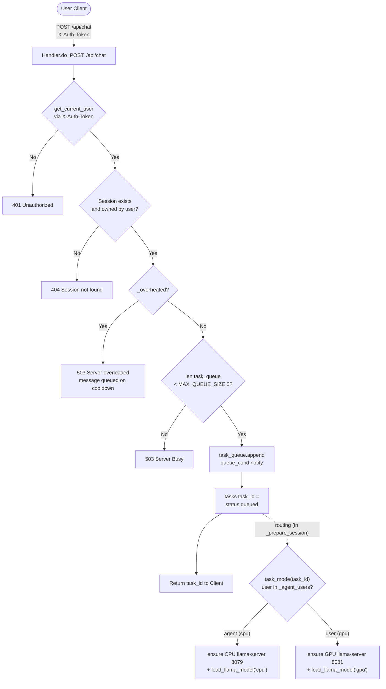

### 8. Queue Worker

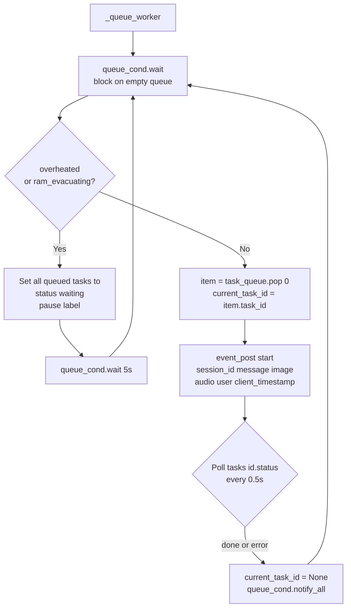

### 9. Event Loop Pipeline

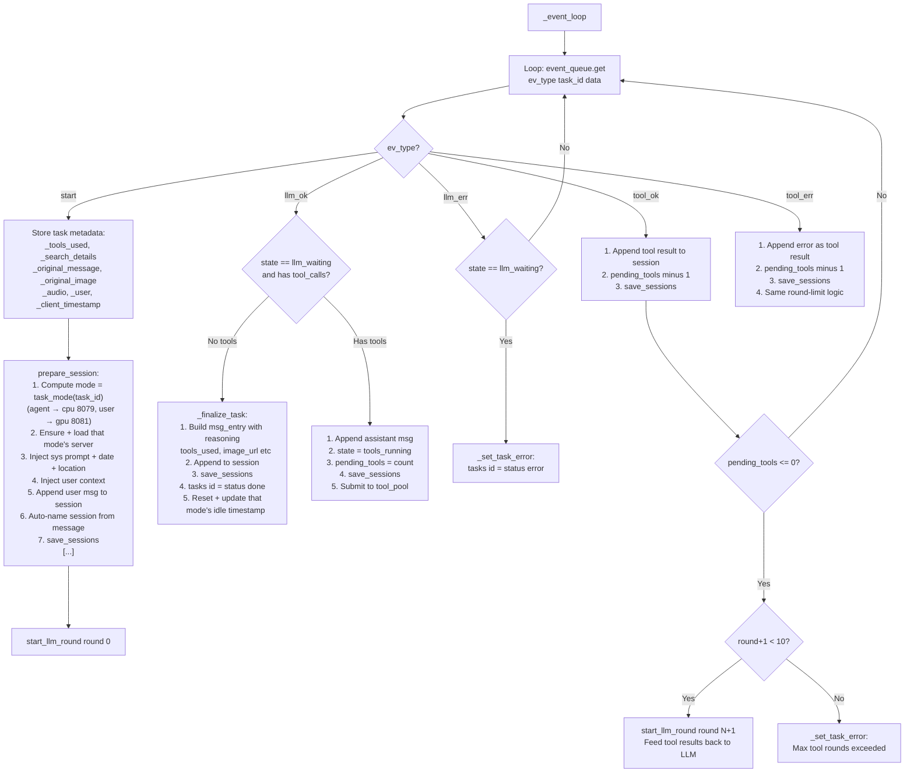

### 10. LLM Worker

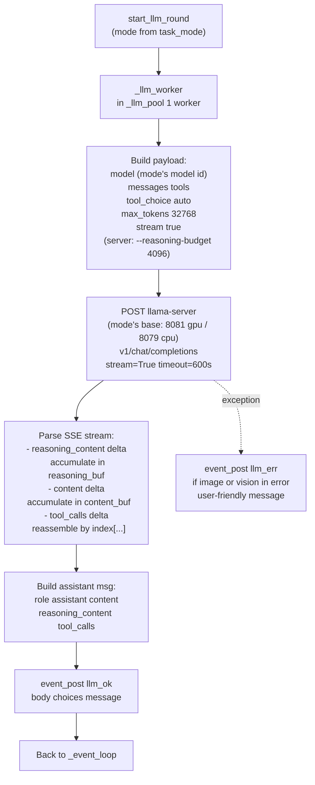

### 11. Tool Worker

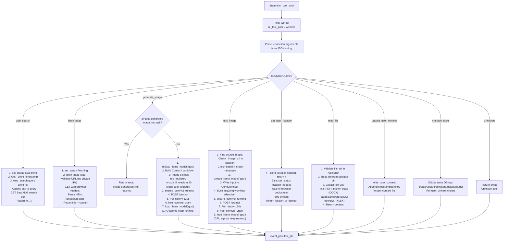

### 12. Resource Management

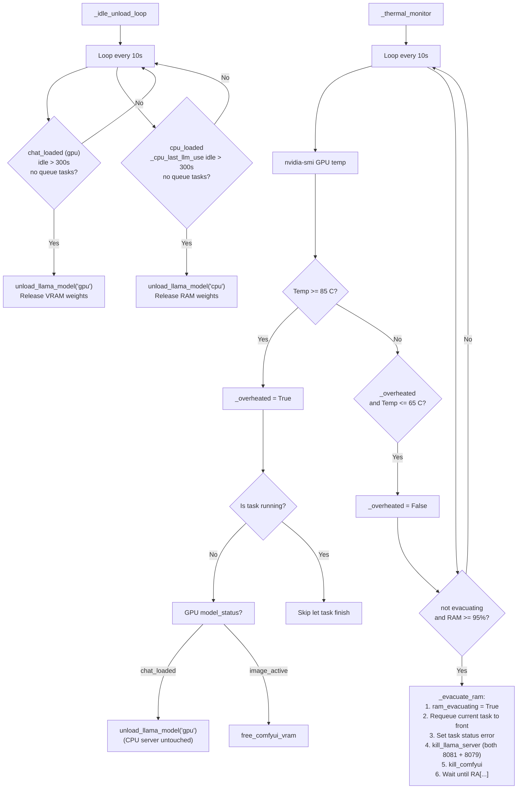
