# Local AI - LLM + Image Generation Setup

Self-hosted LLM + image generation stack on a single laptop (RTX 3050, 4 GB VRAM,
16 GB RAM), fronted by nginx + Authentik SSO, with an MCP gateway, OpenAI-compatible
API, story/document hosting and a GCP reverse proxy + DDNS heartbeat.

## Services & Ports

| Port | Service | What it does | Auth |
|---|---|---|---|
| 3001 | `chat-webui.py` | Chat UI (SPA), `/api/*`, `/v1/*` OpenAI API, `/s/` public shares | SSO + Bearer |
| 3002 | `markdown_hosting.py` | Story/collection hosting with role RBAC (`free`/`premium`/`admin`) | SSO + Bearer |
| 8000 | MCP gateway (`server/mcp_gateway.py`) | MCP surface exposing sessions/chat/batch tools + OAuth server | `MCP_OAUTH_*` |
| 8081 | llama-server **GPU** | Interactive chat UI users (VRAM-backed) | internal |
| 8079 | llama-server **CPU** | Self-chat agents (editor/moderator/registered agents), RAM-backed | internal |
| 8083 | llama-server **guardrail** | MCP L2/L3 LLM verification judge (lazy-start, idle-unload) | internal |
| 8188 | ComfyUI | Image generation/edit (started on demand, `--lowvram`) | internal |
| 8080 | SearXNG (Docker) | Web search backend (`/search/`) | internal |
| 8082 | Nextcloud (Docker) | `cloud-app` + `cloud-db` (mariadb), `/cloud/` | SSO |
| 9000 | `code_host.py` | Code browsing host, `/code/` | SSO |
| 9010 | Authentik proxy outpost | nginx `auth_request` SSO gate (`ak_outpost`) | SSO |
| 9008 | Authentik server | Identity provider, `/sso` (`ak_server`) | SSO |
| 9863 / 53 (UDP+TCP) | GCP heartbeat receiver | `scripts/gcp_heartbeat_server.py` — heartbeat + split-horizon DNS over WireGuard | — |

`chat-webui.py` (3001) is the central process: it owns the chat engine, the three
llama-server lanes (GPU/CPU/guardrail), the image worker, and it is the upstream
that both the MCP gateway (8000) and OpenAI clients talk to.

## Requirements

- NVIDIA GPU with the driver working — check with `nvidia-smi`.
- CUDA toolkit (`nvcc`) needed to build llama.cpp; `setup.sh` installs it if missing.
- `setup.sh` also installs system deps (git, python3, cmake, nginx, avahi-daemon,
  `pdftotext`, `catdoc`, `antiword`, docker, node 18) and builds llama.cpp
  (`-DGGML_CUDA=ON`), ComfyUI (venv) and the Vite frontend (`dist/`).

## Quick Start — Host OS

```bash
# 1. Clone and build
git clone <this-repo> ~/git/local-ai
cd ~/git/local-ai
bash setup.sh

# 2. Post-processing — download your models (setup.sh does NOT download them)
#    LLM (chat):   put a GGUF into ~/local-ai-files/my-models/
#                  model.json holds "gpu" (chat UI) and "cpu" (self-chat agents)
#                  model ids — edit it if you use other models
#    Image (z_image): copy these into ~/local-ai/ComfyUI/models/:
#      diffusion_models/z_image_turbo_bf16.safetensors
#      text_encoders/qwen_3_4b.safetensors
#      vae/ae.safetensors

# 3. Run — nothing else to configure
cd ~/git/local-ai && python chat-webui.py
```

Access at `http://chat.local` / `http://localhost:3001` (direct) or, on the
deployed box, `https://home.palashkantikundu.in` through nginx.

Authentication is unified **SSO via Authentik** — see "Authentication (SSO)" below.

Self-chat agents (editor/moderator/registered agents) run on the CPU llama-server
(`http://localhost:8079`) by default so they never compete with interactive UI
users for VRAM. To run them on the interactive GPU server instead, set
`SELF_CHAT_MODE=gpu` in the environment or in `server/config.py`:

```bash
SELF_CHAT_MODE=gpu python chat-webui.py
```

Note: the checked-in `server/config.py` currently has `FORCE_GPU_LANE = True`, a
**test-time flag** that pins *every* task — including self-chat agents — to the
fast GPU lane (see §7) and stops the CPU/guardrail servers from being started at
boot. Flip it to `False` to restore the production routing above.

`chat-webui.py` auto-starts the llama-servers on boot when they're down (CPU and
guardrail only if needed) and starts ComfyUI on demand. Manual equivalents:

```bash
# GPU llama-server — interactive chat UI users (VRAM-backed, 32K context)
~/local-ai/llama.cpp/build/bin/llama-server \
    --host 127.0.0.1 --port 8081 \
    --models-dir ~/local-ai-files/my-models/ \
    --jinja -ngl 99 -fa on --ctx-size 32768 -ctk q8_0 -ctv q8_0 \
    --no-mmproj-offload -t 8 --cache-reuse 256 \
    --slot-save-path ~/local-ai-files/kv-slots

# CPU llama-server — automated self-chat agents (RAM-backed, 64K context)
~/local-ai/llama.cpp/build/bin/llama-server \
    --host 127.0.0.1 --port 8079 \
    --models-dir ~/local-ai-files/my-models/ \
    --jinja --n-gpu-layers 0 -fa off --ctx-size 65536 -ctk q8_0 \
    --no-mmproj-offload -t 6 --cache-reuse 256 \
    --reasoning-budget 2048 \
    --device none --slot-save-path ~/local-ai-files/kv-slots

# Guardrail llama-server — MCP L2/L3 verification judge (lazy-start, 16K ctx)
~/local-ai/llama.cpp/build/bin/llama-server \
    --host 127.0.0.1 --port 8083 \
    --models-dir ~/local-ai-files/my-models/ \
    --jinja --n-gpu-layers 0 -fa off --ctx-size 16384 -ctk q8_0 \
    --no-mmproj-offload -t 4 --cache-reuse 256 \
    --reasoning-budget 2048 --device none

cd ~/local-ai/ComfyUI && source venv/bin/activate && python main.py \
    --lowvram \
    --input-directory ~/local-ai-files/ComfyUI/input \
    --output-directory ~/local-ai-files/ComfyUI/output
```

## Quick Start — Docker Compose (SearXNG + Nextcloud)

`docker-compose.yaml` runs SearXNG and Nextcloud (`cloud-app` + `cloud-db`) as
sibling containers. The AI stack itself runs on the host via `setup.sh`.

```bash
docker compose up -d
```

- SearXNG exposes `8080:8080`; used only by `chat-webui.py` internally.
- Nextcloud answers on `8082:80` (nginx fronts it at `/cloud/`) and mounts a
  backup disk (`/mnt/wwn-0x50014ee2173893e0-part1/BackUp-Copy-2`) read-only at
  `/mnt/my_backups`.
- Authentik runs from a separate `authentik-compose.yaml` (see below).

## Authentication (SSO)

Authentication is unified **SSO via Authentik** — the single identity provider for
every app on the box. There is **no `users.json` and no per-app password
database**; users, passwords and roles live in Authentik.

**Two identity paths:**

1. **Browsers** — nginx runs an `auth_request` subrequest against the Authentik
   proxy outpost (`location /ak-auth-ai` in `local_cloud.sh`). If the SSO session is
   valid the outpost answers 200 and populates `X-Authentik-*` claim headers, which
   nginx forwards to the upstream apps. On 401 nginx sends the browser to the SSO
   portal (`@ak-sso-ai`). The SPA calls `/api/check-auth` on load to learn who the
   user is.
2. **Machine agents** (`self-chat.py`, MCP gateway) — authenticate via Authentik's
   OAuth2 password grant and send the JWT as `Authorization: Bearer <token>`.
   Backends verify the signature against Authentik's JWKS (`server/auth.py` →
   `identity_from_bearer`).

Resolved identity is always a dict — `username`, `email`, `name`, `groups`, `role`
(`free`/`premium`/`admin` from the user's Authentik groups) and the Authentik `uid`
(`server/auth.py` → `get_identity`). Roles decide Story collection access and the
"overwrite user context" admin action.

**Enabling steps** (one-time):

1. Fill the `AUTHENTIK_*` / `POSTGRES_*` secrets in `.env` (see `authentik-compose.yaml`).
2. Start Authentik: `docker compose -f authentik-compose.yaml up -d`.
3. Open `https://<host>/sso/if/flow/initial-setup/` and create the admin account.
4. Provision groups/users, the `local-ai` OIDC provider and the proxy outpost:
   `python3 scripts/authentik_bootstrap.py`.
5. Deploy the proxy outpost (`ghcr.io/goauthentik/proxy`) with the outpost token the
   bootstrap script prints, on `127.0.0.1:9010` (nginx's `ak_outpost` upstream).
6. Ensure the apps are only reachable through the nginx front-end in `local_cloud.sh`
   (the `auth_request` gate on `/ai/`, `/api/`, `/stories/`, `/story/`), then reload
   nginx.

## Security & Deployment Notes

> **Intended scope: a private, trusted home deployment** — e.g. a household of a few
> users on a home LAN (this project targets ~2–4 concurrent users). The following
> limitations are **accepted risk** for that use case. This stack is **not** built for
> production, the public internet, or a shared LAN where many unknown users work —
> do **not** use it under those conditions.

> **Authentication is unified SSO.** Browser access requires an Authentik session
> (nginx `auth_request`), and per-user identity comes from the forwarded
> `X-Authentik-*` headers (see "Authentication (SSO)" below). The notes that follow
> assume the SSO-enabled nginx front-end (`local_cloud.sh`); running `chat-webui.py`
> directly on port 3001 bypasses all of it.

- **Bypass on bare `chat-webui.py`.** `chat-webui.py` binds to `127.0.0.1` by
  default (`CHAT_HOST`), so it is only reachable through the nginx front-end or
  from the box itself. Setting `CHAT_HOST=0.0.0.0` re-exposes every endpoint
  without the SSO gate — don't.
- **Image endpoints require identity.** `/output/...`, `/uploads/...` and
  `/api/image/...` answer only with valid Authentik SSO headers (browser via
  nginx) or a verified agent JWT (self-chat / MCP gateway). Public share pages
  load images exclusively through the scoped
  `/api/public/share/<token>/image/...` route, which serves only files
  referenced by that share's snapshot.
- **CORS is wide open.** Responses carry `Access-Control-Allow-Origin: *`
  (`chat-webui.py` `do_OPTIONS`/`send_json`). A malicious page on the same origin
  context could call the API and read responses; SSO cookies are HttpOnly and
  SameSite-bound so cross-origin pages cannot use the session.
- **MCP tools are a read-only allowlist.** The outbound MCP client
  (`server/mcp_client.py`) only *advertises* and *dispatches* tools named in
  `MCP_READONLY_TOOL_NAMES` (search/index/graph reads). Mutating codebase tools
  (`delete_project`, `index_repository`, `manage_adr`, `ingest_traces`, …) are
  never shown to the model and are hard-blocked at call time.
- **No TLS/HTTPS on bare 3001.** Login and chat content travel in plaintext if you
  connect without nginx. Always use the TLS-terminating nginx front-end
  (`local_cloud.sh`); never port-forward 3001/8081/8079 directly.
- **No content guardrails on the chat UI.** Chat answers are not moderated. The MCP
  gateway is distinct: it applies L1 pattern + L2/L3 LLM verification (see below).
- **Third-party calls.** `fetch_page` and location lookup call external services
  (SearXNG backends, `nominatim.openstreetmap.org`), and optional TTS can use
  Microsoft `edge-tts` unless you configure the local Piper voices. If strict data
  residency matters, disable or replace these.
- **Compose exposes SearXNG on all host interfaces** (`8080:8080`), while the host path
  binds it to `127.0.0.1`. Bind it to localhost if you don't need LAN-wide search.

## System Design

### 1. Infrastructure & Network

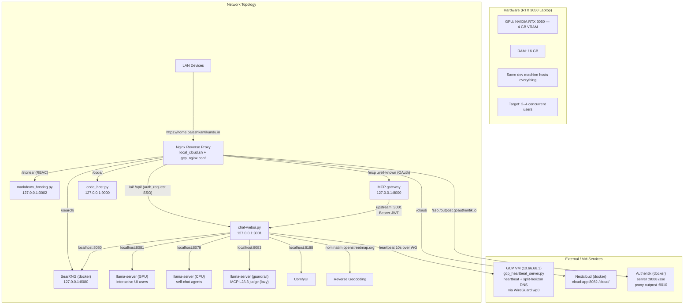

### 2. File Layout & Build

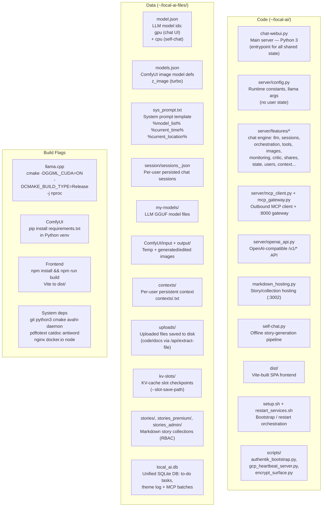

### 3. Runtime Constants & Locks

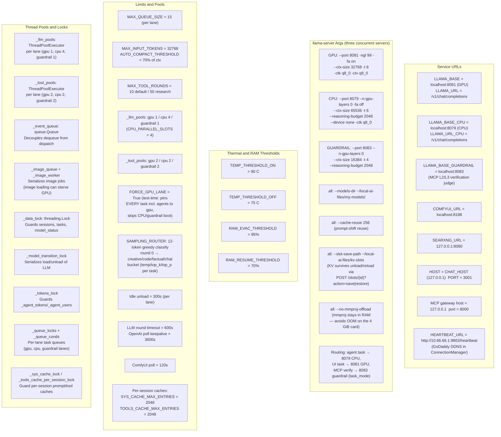

### 4. Server Startup

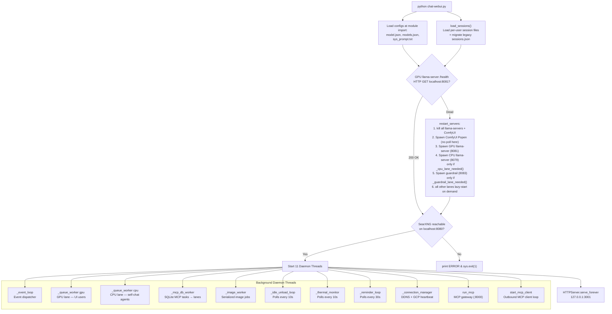

ComfyUI is *not* started at boot — `ensure_comfyui_running()` launches it on
first image request.

### 5. Model State Machine

Three independent state machines run concurrently — one per llama-server lane.

```mermaid
stateDiagram-v2
    direction LR

    state "GPU server (8081) — UI users" as G {
        [*] --> unloaded: gpu
        unloaded --> loading : load_llama_model("gpu")
        loading --> chat_loaded : 200 from /models/load\n+ health check passes
        loading --> unloaded : failed
        chat_loaded --> unloading : unload_llama_model("gpu")\n(snapshots KV via /slots save)
        unloading --> unloaded : 200 from /models/unload
        unloading --> chat_loaded : failed but health OK
        chat_loaded --> image_active : generate_image\nor edit_image starts
        image_active --> chat_loaded : free_comfyui_vram\n+ load_llama_model("gpu")\n(KV restored via /slots restore)
    end

    state "CPU server (8079) — self-chat agents" as C {
        [*] --> cpu_unloaded
        cpu_unloaded --> cpu_loading : load_llama_model("cpu")
        cpu_loading --> cpu_loaded : 200 from /models/load\n+ health check passes
        cpu_loading --> cpu_unloaded : failed
        cpu_loaded --> cpu_unloading : unload_llama_model("cpu")
        cpu_unloading --> cpu_unloaded : 200 from /models/unload
        cpu_unloading --> cpu_loaded : failed but health OK
    end

    state "Guardrail server (8083) — MCP verify (lazy)" as GR {
        [*] --> gr_unloaded
        gr_unloaded --> gr_loading : load for L2/L3 judge
        gr_loading --> gr_loaded : health OK
        gr_loaded --> gr_unloading : idle 300s → unload
        gr_unloading --> gr_unloaded : /models/unload
    end
```

Image generation unloads **only** the GPU server; the CPU server keeps serving
agents throughout. Per-server idle timestamps drive independent unloads
(`_last_llm_use` for GPU, `_cpu_last_llm_use` for CPU, `_guardrail_last_llm_use`
for the guardrail). Before every unload the lane's KV cache is snapshotted to
`~/local-ai-files/kv-slots/` and restored after the model loads again, so the
next completion only evaluates new tokens instead of re-prefilling context.

### 6. REST API Endpoints

```mermaid
graph TD
    Client([User Client])

    subgraph AuthEndpoints ["Auth (SSO)"]
        Client -->|"Browser: nginx auth_request\n→ Authentik SSO portal"| SSO["SSO session cookie set\nX-Authentik-* forwarded upstream"]
        Client -->|"GET /api/check-auth"| CheckAuth["identity from\nX-Authentik-* headers"]
        CheckAuth -- Yes --> AuthOK["{authenticated: true, username, role}"]
        CheckAuth -- No --> AuthNO["{authenticated: false}"]
        Client -->|"Agents: Authorization: Bearer <JWT>"| Bearer["Verify JWT against\nAuthentik JWKS"]
    end

    subgraph SessionEndpoints ["Session Management"]
        Client -->|"POST /api/sessions"| NewSession["Create UUID session\n(optional system_prompt/context_tokens)"]
        Client -->|"GET /api/sessions"| ListSessions["List user sessions\nSorted by updated desc + token report"]
        Client -->|"GET /api/sessions/:id/messages"| GetMessages["Return messages\n+ token_estimate"]
        Client -->|"PUT /api/sessions/:id"| RenameSession["Rename session"]
        Client -->|"DELETE /api/sessions/:id"| DeleteSession["Invalidate session:\n1. Cancel queued/in-flight tasks\n   in all 3 lane queues\n2. Delete assoc. output images +\n   upload refs (except active shares)\n3. delete_session_kv → wipe\n   KV checkpoint + clear resident slot\n4. Pop sessions/_effective_contexts\n5. save_sessions"]
    end

    subgraph TaskEndpoints ["Task Management"]
        Client -->|"GET /api/tasks"| ListTasks["List user tasks\nwith reminders"]
        Client -->|"POST /api/tasks"| CreateTask["Create task\n(title, priority, due_date, reminder)"]
        Client -->|"PUT /api/tasks/:id"| UpdateTask["Update task fields"]
        Client -->|"DELETE /api/tasks/:id"| DeleteTask["Delete task"]
    end

    subgraph AgentEndpoints ["Agent / Presence"]
        Client -->|"POST /api/register-agent"| RegisterAgent["Create agent token\nfor self-chat bots\n(kolpo, kaya, editor, moderator)"]
        Client -->|"POST /api/leaving"| Leaving["Set user's active window\nnow → end (presence)"]
        Client -->|"GET /api/active-users"| ActiveUsers["List currently active users\n(excludes agents)"]
    end

    subgraph UtilityEndpoints ["Utility"]
        Client -->|"GET /api/model-status"| ModelStatus["model_status, _last_tps\n_overheated, _gpu_temp,\nreminder_count, max_context"]
        Client -->|"POST /api/extract-file"| ExtractFile["Save uploaded file to disk\n(~/local-ai-files/uploads/)\nReturn {url, name}"]
        Client -->|"POST /api/upload-image"| UploadImage["Save image base64\n→ /uploads/<uuid>"]
        Client -->|"POST /api/location"| SetLocation["Reverse geocode via Nominatim\nstore _client_location\nsignal _location_events[task_id]"]
        Client -->|"GET/POST /api/user-context"| CopyUserCtx["read / write / overwrite\n(admin) user context file"]
        Client -->|"POST /api/tts"| TTS["Text-to-speech via Piper (local)\nor edge-tts (cloud fallback)"]
        Client -->|"GET /api/shares"| ListShares["List user shares"]
        Client -->|"POST /api/shares"| CreateShare["Create share → {token, url}"]
        Client -->|"DELETE /api/shares/:token"| RevokeShare["Revoke share (optional ?purge=1)"]
        Client -->|"GET /output/:filename /uploads/:filename\n/api/image/:id"| ServeImage["Serve generated/uploaded images\n(SSO headers or JWT required)"]
        Client -->|"GET /api/public/share/:token\n/api/public/share/:token/image/:id"| PubShare["Public share snapshot\n(no auth; only ref'd images)"]
    end

    subgraph SPA ["Static / SPA Serving"]
        Client -->|"GET /"| SPAIndex["Serve dist/index.html"]
        Client -->|"GET /*"| SPAAssets["Serve dist/ assets\nor SPA fallback"]
        Client -->|"/s/:token"| PublicSharePage["Public share page\n(served by nginx from dist/, no auth)"]
    end

    subgraph StatusPolling ["Status Polling"]
        Client -->|"GET /api/status/:task_id"| PollStatus["Return tasks id:\nstatus message response\ntools_used image etc"]
    end
```

### 7. Chat Ingress Flow

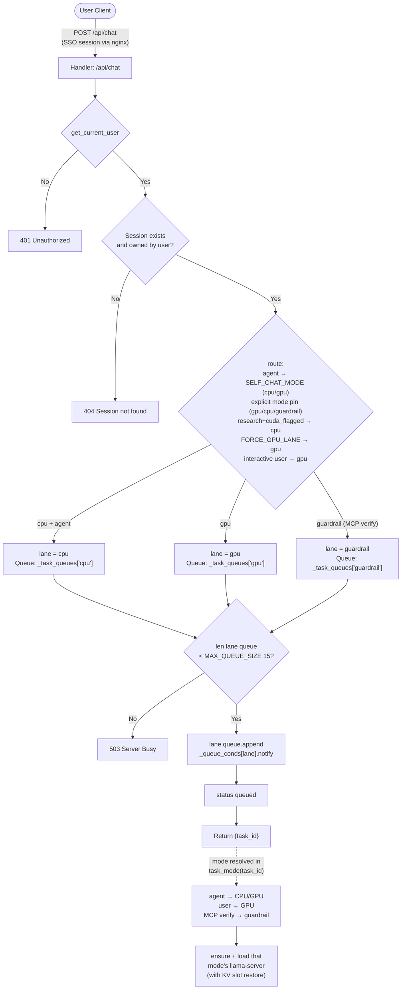

### 8. Queue Workers (one per lane)

A separate worker drains each lane (`_queue_worker("gpu")`, `_queue_worker("cpu")`,
and the SQLite-driven guardrail tasks via `_mcp_db_worker`), each with its own
lock/condition/queue. The lanes never wait behind each other; they only share
hardware when both need the GPU (chat load / image gen), which is arbitrated
separately. (The CPU-lane "yield to human presence" pause is disabled in the
current code — self-chat agents run on the CPU server continuously.)

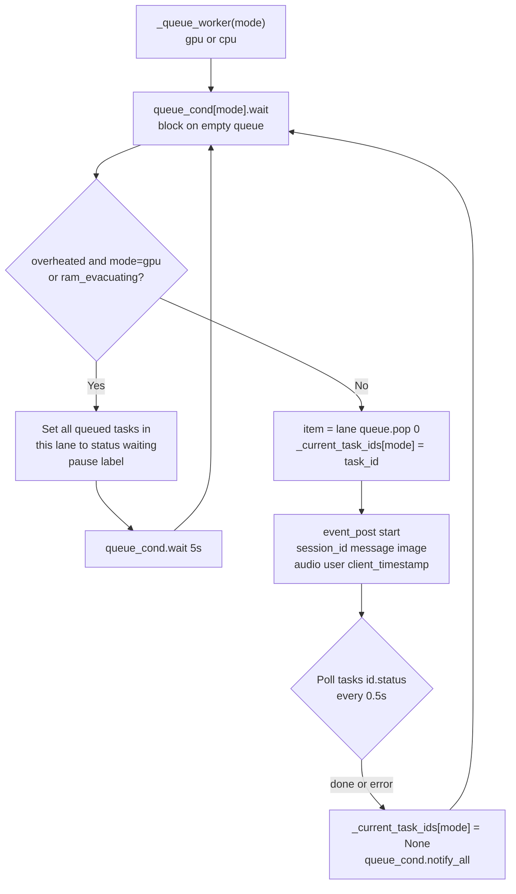

### 9. Event Loop Pipeline

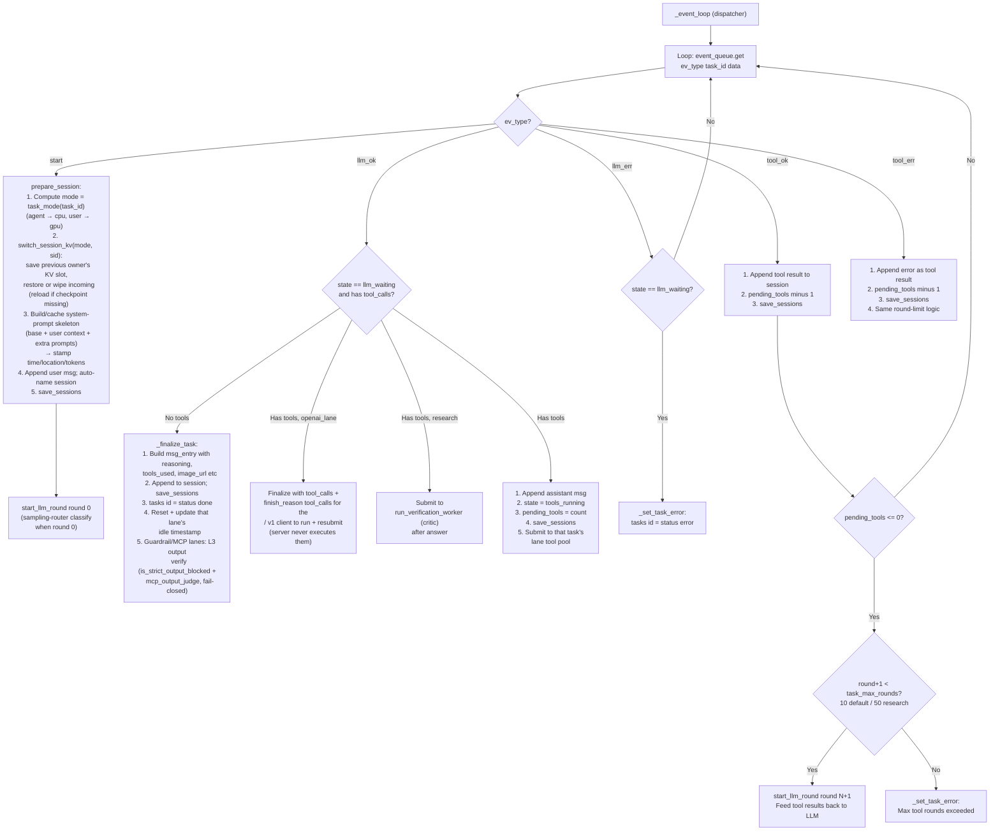

### 10. LLM Worker

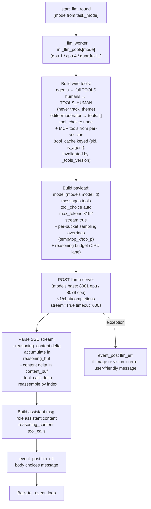

Context assembly also invokes `switch_session_kv` per task and reads the user's
`contexts/<user>.txt` file every turn (with the *static* skeleton cached per
session and invalidated per user after a context write).

### 11. Tool Worker

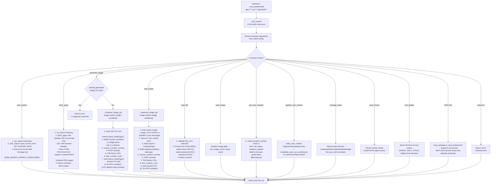

`generate_image`/`edit_image` unload **only** the GPU model while CPU agents keep
serving. The GPU unload snapshots the active session's KV so the reload restores
it (~0 re-prefill cost after image generation).

### 12. Resource Management

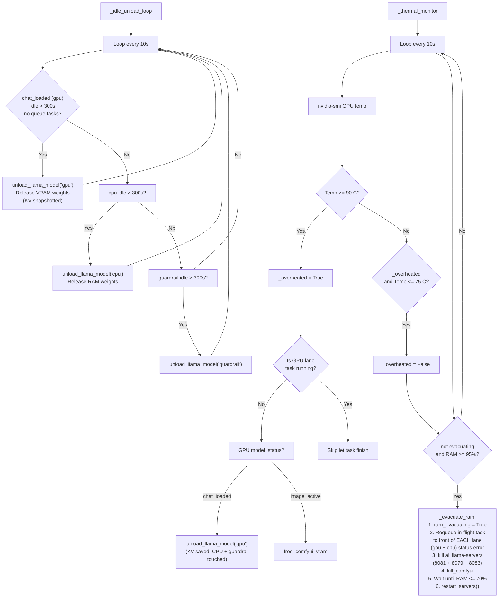

### 13. MCP Gateway (`localhost:8000`)

Exposes the chat engine to MCP clients as a stateless HTTP MCP server
(`server/mcp_gateway.py`, FastMCP "chat-webui-api"). It authenticates clients via
`MCP_OAUTH_CLIENT_ID`/`MCP_OAUTH_CLIENT_SECRET` (OAuth `client_credentials` or a
self-checking Bearer), then acts as the single identity `MCP_USER`, and calls the
3001 upstream with a self-refreshing Authentik OIDC access token from the
`oidc_password_grant`.

**MCP tools:** `get_user_context`, `list_sessions`, `create_session`,
`get_session_messages`, `rename_session`, `send_chat_message`, `get_message_status`,
`start_chat_batch`, `get_batch_status`, `get_batch_results`, `submit_batch_results`,
`get_image`.

**Batch pipeline:** `start_chat_batch` inserts rows into the SQLite `batches`/`mcp_tasks`
tables; a `_batch_worker` (poll 15s, per-item timeout 2400s) and the `_mcp_db_worker`
drain them into the gpu/cpu lanes.

**Safety (layered guardrail):**
- **L1** — `server/input_guard.py` pattern layer: `is_jailbreak_attempt`,
  `is_harmful_request`, `is_harmful_content`, `is_strict_output_blocked`
  (substring matching over dediacriticized text).
- **L2** — LLM input judge on the **guardrail lane** (8083), default `fail_closed`.
- **L3** — LLM output judge at `_finalize_task` (`mcp_output_judge`, truncates to
  6000 chars, fail-closed, self-heals by once restarting the guardrail server).
- The guardrail server is lazy-started (`ensure_guardrail_ready`) and
  idle-unloads after `VERIFY_IDLE_TIMEOUT = 300`s.

**OAuth server** is also hosted by the gateway: `/authorize`, `/oauth/token`,
`/.well-known/oauth-authorization-server`, `/.well-known/oauth-protected-resource`.
Nginx fronts these under the domain root (see `local_cloud.sh`).

**Outbound MCP client** (`server/mcp_client.py`) connects to `mcp_config.json`
servers (currently `codebase-search` via `npx codebase-memory-mcp`). Only the
`MCP_READONLY_TOOL_NAMES` allowlist (`search_graph`, `trace_path`,
`check_index_coverage`, `detect_changes`, `query_graph`, `get_architecture`,
`get_graph_schema`, `get_code_snippet`, `search_code`, `list_projects`,
`index_status`) is advertised to the model and dispatchable; everything else is
hard-blocked at call time. Tool results are streamed under a 4000-character budget
with a truncation note in the reply. The tool list is cached and versioned
(`_tools_version`) so per-session tool caches invalidate when it changes.

### 14. OpenAI-Compatible API (`/v1/*` on 3001)

Enabled when `OPENAI_API_KEY` is set. Bearer-auth via the static key, with
`hmac.compare_digest` comparison. Endpoints: `GET /v1/`, `GET /v1/models`,
`GET /v1/models/:id`, `POST /v1/chat/completions`.

- Requests map onto the normal engine: a fresh `api_<uuid>` session, prior
  messages injected as history, **always GPU lane**, `no_tools=True`,
  `skip_ensure_llama=True`.
- Non-streaming → single `chat.completion` JSON; streaming → SSE chunks ending
  in `data: [DONE]`, with comment keepalives every 10s so Node/undici clients
  don't abort (poll timeout 3600s).
- Tool calls are **not executed** server-side in this lane: when the model asks
  for tools the engine finalises with `finish_reason: "tool_calls"` so the client
  runs them and resubmits (the standard OpenAI contract).

### 15. Session Persistence & KV Cache

- Per-user session files `~/local-ai-files/session/sessions_<user>.json`; a
  unified `local_ai.db` (SQLite) holds to-do tasks, theme log and MCP batches.
- **KV slot checkpoints** (`llm.py` + llama-server `--slot-save-path`): `llm.py`
  calls `POST /slots/{id}?action=save|restore` around every unload/reload and on
  every session switch. `switch_session_kv` records which session currently owns
  each lane's physical slot (`_active_slot_session`); when a different session
  arrives it saves the previous owner's KV and restores the new one, or wipes the
  slot (`_reload_clear_slot`) when no checkpoint exists.
- **Deleting a session** cancels its queued/in-flight tasks across all lanes,
  cleans up associated images/uploads (except live share refs), removes its KV
  checkpoint and wipes a still-loaded slot so no stale prefix leaks into the next
  session.
- **Per-session caches** (`state.py`): the static system-prompt skeleton
  (base prompt + user context + extra prompts) and the per-session tool list are
  built once and reused. `invalidate_user_sys_cache` drops cached skeletons for a
  user after `write_user_context`; the tool cache invalidates when the MCP tool
  set changes. Both caches are capped at 2048 entries (oldest evicted first).
- **Sampling router** classifies round-0 intent (12-token greedy call) into
  creative/code/factual/chat and applies a per-bucket sampling profile
  (temperature/top_k/top_p) to every round of that task.

## Story Hosting (`markdown_hosting.py`, :3002)

Serves Markdown story collections with role-based access: `free_stories` (any
identity), `premium_stories` (premium+), `admin_stories` (admin only). Routes:

- `/` — collections index (only collections ≤ your role level; unauthenticated
  sees `free_stories` as guest).
- `/story/<collection>/<id>` — rendered HTML with KaTeX math and image `src=`
  rewritten to `/media/<collection>/<id>/...`.
- `/story/<collection>/<id>/content` — live-poll endpoint returning incremental
  HTML `{"html": ...}` as a story is being authored.
- `/media/<collection>/<id>/<file>` — RBAC-gated image bytes.
- `DELETE /story/<collection>/<id>` — admin-only folder removal.

Identity comes from nginx `X-Authentik-*` headers or a Bearer JWT. Collection
roots are set via `STORIES_FREE_DIR`/`STORIES_PREMIUM_DIR`/`STORIES_ADMIN_DIR`
(required; the app fails fast if premium/admin dirs are unset).

## Self-Chat Production Pipeline (`self-chat.py`)

Offline, autonomous story-generation pipeline. Two LLM agents — `kolpo` (A) and
`kaya` (B) — log in via Authentik OIDC password grant and chat through the normal
CPU lane to author stories; `editor` polishes via `prompts/editor.txt`, and
`moderator` issues a GREEN/RED verdict and writes `*.moderation.json`. Details
come from `prompts/master_details.json`, personas from `persona_pool.json` /
`genre_persona_map.json`, and task plans from `tasks.json` (default 12 tasks).

- `--dry-run` prints the full plan with no LLM call; `--config FILE` uses a custom
  task list; `--gpu` routes agents to the GPU server instead of CPU.
- Deterministic **auto-RED gates** (`verify_task_fulfillment`): wrong medium,
  dropped headers/citations, wrong script, prohibited names, or left-over
  `<!-- EDITOR FLAG:` comments fail the story before moderation.
- Theme tracking dedups: an identical persona/genre combo is never reused back to
  back; the tracker lives in the shared SQLite theme log scoped to `self-chat`.
- Runs in a loop with a 900s "vacation" between rounds.

## Frontend (React SPA, `src/`)

Vite + React 19, built to `dist/` (`npm run build`). Components in `src/components/`
(ChatArea, Sidebar, ModelBar, StatusBox, TaskPanel, ImageLightbox, Message,
InputBar, LocationPrompt, OverloadWarning, PublicShareView). Features: streaming
chat with tool indicators, image generation/render, file upload, location prompt,
live model-status meter, to-dos/reminders panel, share creation with a public
share page (`/s/:token`) that loads only the share snapshot's images.