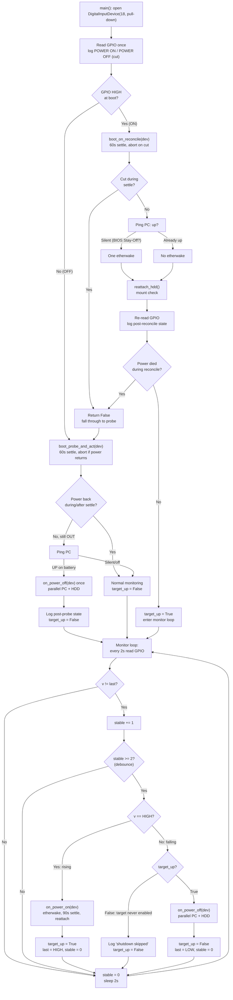
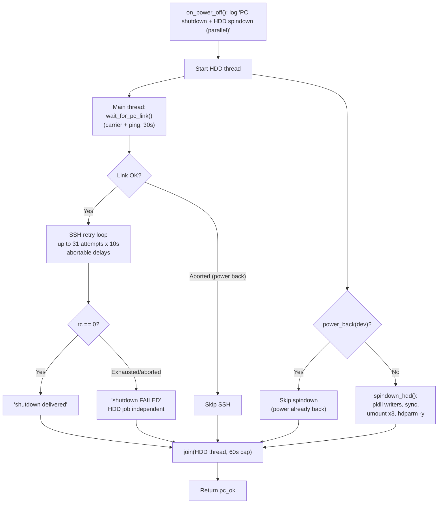
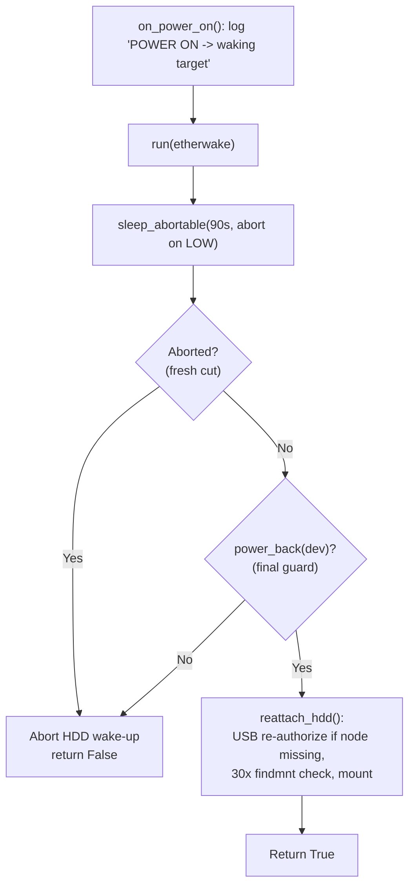

# `main()` flowchart — `power_cut_detect.py`

```mermaid
flowchart TD
    A["main(): open DigitalInputDevice(18, pull-down)"] --> B["Read GPIO once<br/>log POWER ON / POWER OFF (cut)"]
    B --> C{"GPIO HIGH<br/>at boot?"}
    C -- "Yes (ON)" --> D["boot_on_reconcile(dev)<br/>60s settle, abort on cut"]
    D --> E{"Cut during<br/>settle?"}
    E -- Yes --> F["Return False<br/>fall through to probe"]
    E -- No --> G["Ping PC: up?"]
    G -- "Silent (BIOS Stay-Off?)" --> H["One etherwake"]
    G -- "Already up" --> I["No etherwake"]
    H --> J["reattach_hdd()<br/>mount check"]
    I --> J
    J --> K["Re-read GPIO<br/>log post-reconcile state"]
    K --> L{"Power died<br/>during reconcile?"}
    L -- Yes --> F
    L -- No --> M["target_up = True<br/>enter monitor loop"]
    C -- "No (OFF)" --> N["boot_probe_and_act(dev)<br/>60s settle, abort if power returns"]
    F --> N
    N --> O{"Power back<br/>during/after settle?"}
    O -- Yes --> P["Normal monitoring<br/>target_up = False"]
    O -- "No, still OUT" --> Q["Ping PC"]
    Q -- "Silent/off" --> P
    Q -- "UP on battery" --> R["on_power_off(dev) once<br/>parallel PC + HDD"]
    R --> S["Log post-probe state<br/>target_up = False"]
    S --> T["Monitor loop"]
    P --> T
    M --> T
    T["Monitor loop:<br/>every 2s read GPIO"] --> U{"v != last?"}
    U -- No --> V["stable = 0<br/>sleep 2s"]
    V --> T
    U -- Yes --> W["stable += 1"]
    W --> X{"stable >= 2?<br/>(debounce)"}
    X -- No --> V
    X -- Yes --> Y{"v == HIGH?"}
    Y -- "Yes: rising" --> Z["on_power_on(dev)<br/>etherwake, 90s settle, reattach"]
    Z --> AA["target_up = True<br/>last = HIGH, stable = 0"]
    AA --> V
    Y -- "No: falling" --> AB{"target_up?"}
    AB -- "False: target never enabled" --> AC["Log 'shutdown skipped'<br/>target_up = False"]
    AB -- "True" --> AD["on_power_off(dev)<br/>parallel PC + HDD"]
    AD --> AE["target_up = False<br/>last = LOW, stable = 0"]
    AC --> V
    AE --> V
```

## Sub-flow: `on_power_off(dev)` (parallel kill)

```mermaid
flowchart TD
    A["on_power_off(): log 'PC shutdown + HDD spindown (parallel)'"] --> B["Start HDD thread"]
    B --> C{"power_back(dev)?"}
    C -- Yes --> D["Skip spindown<br/>(power already back)"]
    C -- No --> E["spindown_hdd():<br/>pkill writers, sync,<br/>umount x3, hdparm -y"]
    B --> F["Main thread:<br/>wait_for_pc_link()<br/>(carrier + ping, 30s)"]
    F --> G{"Link OK?"}
    G -- "Aborted (power back)" --> H["Skip SSH"]
    G -- Yes --> I["SSH retry loop<br/>up to 31 attempts x 10s<br/>abortable delays"]
    I --> J{"rc == 0?"}
    J -- Yes --> K["'shutdown delivered'"]
    J -- "Exhausted/aborted" --> L["'shutdown FAILED'<br/>HDD job independent"]
    K --> M["join(HDD thread, 60s cap)"]
    L --> M
    H --> M
    D --> M
    E --> M
    M --> N["Return pc_ok"]
```

## Sub-flow: `on_power_on(dev)` (restore)

```mermaid
flowchart TD
    A["on_power_on(): log 'POWER ON -> waking target'"] --> B["run(etherwake)"]
    B --> C["sleep_abortable(90s, abort on LOW)"]
    C --> D{"Aborted?<br/>(fresh cut)"}
    D -- Yes --> E["Abort HDD wake-up<br/>return False"]
    D -- No --> F{"power_back(dev)?<br/>(final guard)"}
    F -- No --> E
    F -- Yes --> G["reattach_hdd():<br/>USB re-authorize if node missing,<br/>30x findmnt check, mount"]
    G --> H["Return True"]
```
